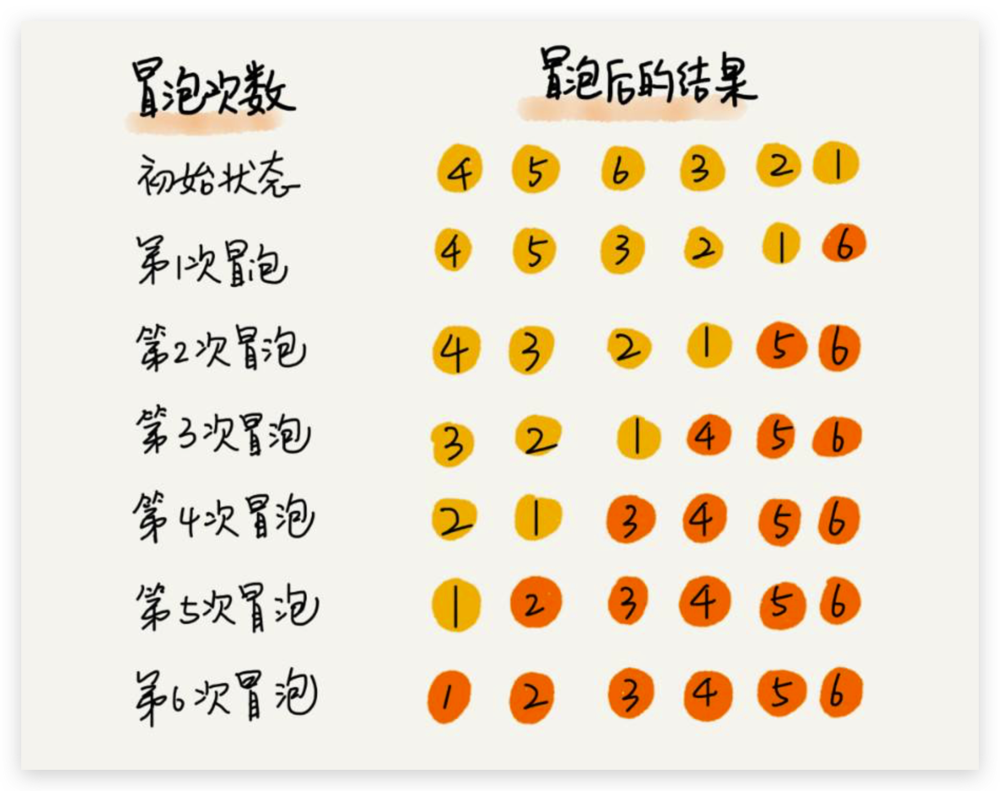
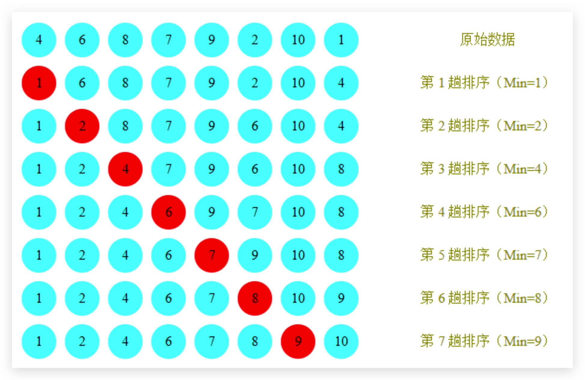
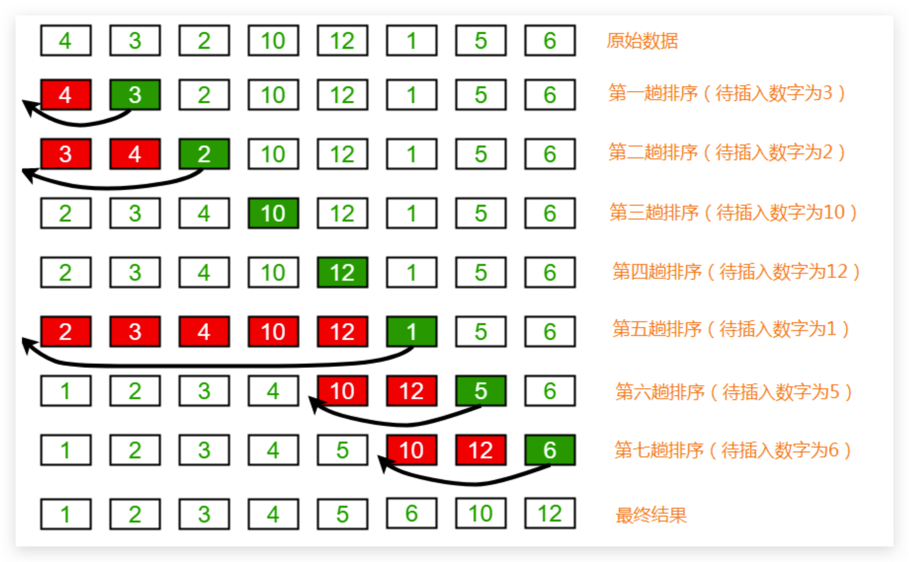
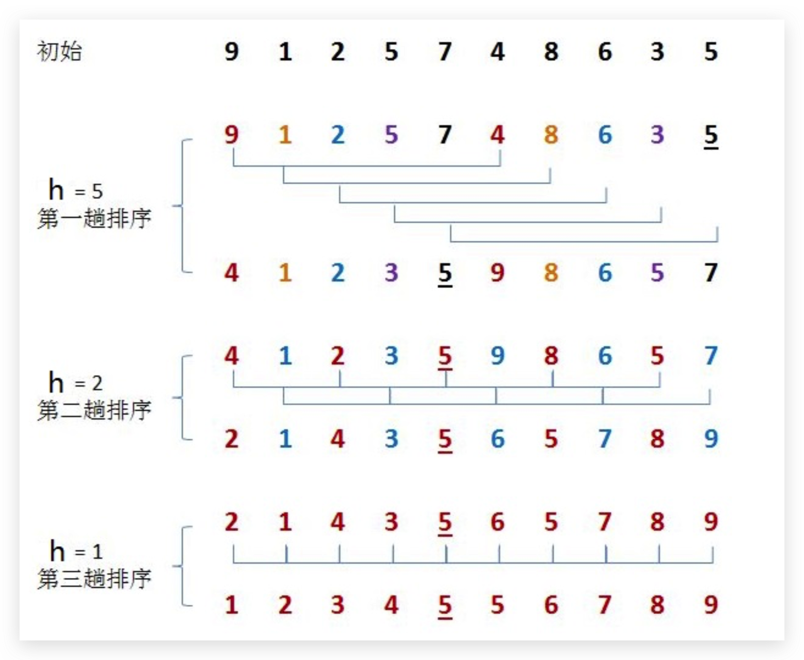
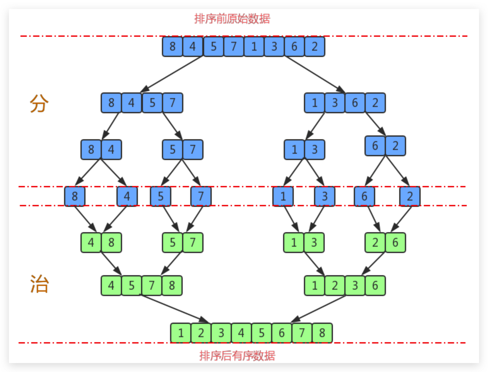
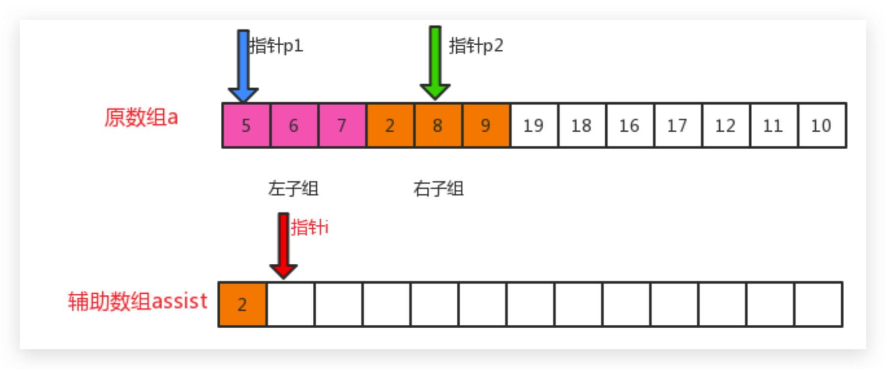
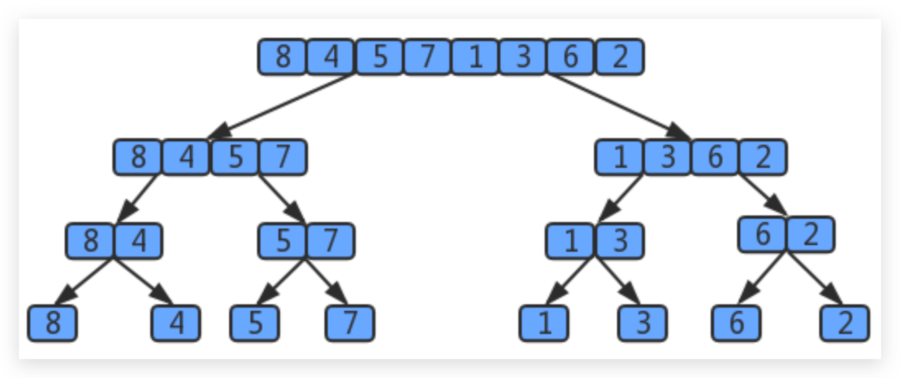

# 数据结构

## 分类

### 逻辑结构

- 集合结构
- 线性结构
- 树形结构
- 图形结构

### 物理结构

- 顺序存储结构
- ‘链式存储结构’

## 算法分析

### 分析方法

- 事后分析
  - 必须依据算法实现编制好的测试程序，通常要花费大量时间和精力，测试完 了如果发现测试的是非常糟糕的算法，那么之前所做的事情就全部白费了，并且不同的测试环境(硬件环境)的差别 导致测试的结果差异也很大
- 事前分析
  - 如果算法固定，那么该算法的执行时间主要取决于问题的输入规模
  - 研究算法复杂度，侧重的是当输入规模不断增大时，算法的增长量的一个抽象(规律)，而不是精确地定位需要 执行多少次。所以分析算法复杂度时只考虑核心代码的执行次数，忽略循环索引的递增和循环终止的条件、变量声明、打印结果等操作

### 结论

- 算法函数中的常数可以忽略
- 算法函数中最高次幂的常数因子可以忽略
- 算法函数中最高次幂越小，算法效率越高

### 算法时间复杂度

#### 大O记法

- 用常数1取代运行时间中的所有加法常数
- 在修改后的运行次数中，只保留高阶项
- 如果最高阶项存在，且常数因子不为1，则去除与这个项相乘的常数
- 对于对数阶，由于随着输入规模n的增大，不管底数为多少，他们的增长趋势是一样的，所以我们会忽略底数

#### 常见复杂度

- O(1)<O(logn)<O(n)<O(nlogn)<O(n^2)<O(n^3)

- 尽可能的追求的是O(1),O(logn),O(n),O(nlogn)这几种时间复杂度，而如果发现算法的时间复杂度为平方阶、 立方阶或者更复杂的，那我们可以分为这种算法是不可取的，需要优化

#### 最坏情况

- 一般来说，运行时间指的是最坏情况下的运行时间

## 排序算法

### 冒泡排序

#### 原理

- 比较相邻的元素。如果前一个元素比后一个元素大，就交换这两个元素的位置。
- 对每一对相邻元素做同样的工作，从开始第一对元素到结尾的最后一对元素。最终最后位置的元素就是最大

值。



#### 复杂度

- O(N2)

#### 代码

```java
public static void sort(Comparable[] arr) {
        //外层循环控制冒泡的轮数
        for (int i = 1, len = arr.length; i <= len - 1; i++) {
            //内层循环控制每轮交换的次数
            for (int j = 1; j <= len - i; j++) {
                if (isGreater(arr[j - 1], arr[j]))
                    exchange(arr, j - 1, j);
            }
        }
    }

    private static boolean isGreater(Comparable a, Comparable b) {
        return a.compareTo(b) > 0;
    }

    private static void exchange(Comparable[] arr, int i, int j) {
        Comparable temp = arr[i];
        arr[i] = arr[j];
        arr[j] = temp;
    }
```


### 选择排序

#### 原理

- 每一次遍历的过程中，都假定第一个索引处的元素是最小值，和其他索引处的值依次进行比较，如果当前索引处的值大于其他某个索引处的值，则假定其他某个索引出的值为最小值，最后可以找到最小值所在的索引

- 交换第一个索引处和最小值所在的索引处的值



#### 复杂度

- O(N2)

#### 代码

```java
public static void sort(Comparable[] arr) {
        //第一轮控制排序的轮数
        for (int i = 0, len = arr.length; i < len; i++) {
            //第二轮控制每轮中比较的次数
            for (int j = i + 1; j <= len - 1; j++) {
                if (isGreater(arr[i], arr[j]))
                    exchange(arr, i, j);
            }
        }
}
```

### 插入排序

#### 原理

- 把所有的元素分为两组，已经排序的和未排序的
- 默认情况下把第一个元素作为已排序元素，倒序遍历已排序元素，依次跟未排序第一个元素（待插入元素）比较，如果大于待插入元素，则交换位置，否则找到正确位置，退出循环



#### 复杂度

- O(N2)

#### 代码

```java
public static void sort(Comparable[] arr) {
        //外层循环表示已排序部分元素最大索引
        for (int i = 0, len = arr.length; i <= len - 2; i++) {
            //内层循环表示未排序元素中第一个元素从右向左依次比较已排序的元素，如果比自己大就交换，否则推出循环表示已找到对应位置
            for (int j = i + 1; j > 0; j--) {
                if (isGreater(arr[j - 1], arr[j])) {
                    exchange(arr, j - 1, j);
                } else {
                  	//找到合适的位置，停止交换
                    break;
                }
            }
        }
}
```

### 希尔排序

#### 原理

- 希尔排序是插入排序的一种，又称“缩小增量排序”，是插入排序算法的一种更高效的改进版本。

- 选定一个增长量h，按照增长量h作为数据分组的依据，对数据进行分组

- 对分好组的每一组数据完成插入排序

- 减小增长量，最小减为1，重复第二步操作

- 增长量h的确定规则：

  ```java
  int h=1; 
  while(h<数组的长度/2){
  	h=2h+1;
  }
  //循环结束后我们就可以确定h的最大值; h的减小规则为:
  h=h/2
  ```

  



#### 复杂度

- 希尔排序的时间复杂度与增量的选取有关。当增量为1时，退化成插入排序，复杂度O(N2)。最好情况下复杂度O(NlogN)，平均复杂度O(N^1.5)

#### 代码

```java
public static void sort(Comparable[] arr) {
        int len = arr.length;
        int h = 1;
        while (h < len / 2) {
            h = 2 * h + 1;
        }
        while (h >= 1) {
            //外层循环表示每一个分组
            for (int i = 0; i + h < len; i++) {
                //内层循环表示对每一个分组进行插入排序
                for (int j = i + h; j >= h; j -= h) {
                    if (isGreater(arr[j - h], arr[j]))
                        exchange(arr, j - h, j);
                    else
                        break;
                }
            }
            h = h / 2;
        }
}
```

### 归并排序

#### 原理

- 将一组数据拆分为两等分组，并继续对其中每一个子组进行拆分，直到最后每一个分组中元素个数为1为止
- 将 相邻两个子组进行合并，并且在合并过程中对数据进行排序，直至整个数组数据变成有序



- 在具体合并过程中，使用三个指针完成数据排序。不断比较左右子组指针对应的元素大小，将较小者放置在assist中，并将指针向后移动，直至其中一组或者全部组元素遍历完毕。如果还有组中有剩余未被遍历的元素，直接将其按顺序放置到assist数组中，最后将assist中元素拷贝到原数组中即可



#### 复杂度

- O(NlogN)



用树状图来描述归并，如果一个数组有8个元素，那么它将每次除以2找最小的子数组，共拆log28次，值为3，所以 树共有3层,那么自顶向下第k层有2^k个子数组，每个数组的长度为2^(3-k)，归并最多需要2^(3-k)次比较。因此每层 的比较次数为 2^k * 2^(3-k)=2^3,那么3层总共为 3*2^3。

假设元素的个数为n，那么使用归并排序拆分的次数为log2(n),所以共log2(n)层，那么使用log2(n)替换上面3*2^3中 的3这个层数，最终得出的归并排序的时间复杂度为:log2(n)* 2^(log2(n))=log2(n)*n,根据大O推导法则，忽略底数，最终归并排序的时间复杂度为O(nlogn)。

#### 代码

```java
public static void sort(Comparable[] arr) {
        int length = arr.length;
        assist = new Comparable[length];
        sort(arr, 0, length - 1);
    }

    public static void sort(Comparable[] arr, int low, int high) {
        if (low >= high)
            return;
        //中间值作为分组的界限
        int mid = (low + high) / 2;
        //对左子组排序
        sort(arr, low, mid);
        //对右子组排序
        sort(arr, mid + 1, high);
        //合并子组
        merge(arr, low, mid, high);
    }

    public static void merge(Comparable[] arr, int low, int mid, int high) {
        int idx = low;
        int left = low;
        int right = mid + 1;
        //不断移动左右子组指针
        while (left <= mid && right <= high) {
            //把较小者放置到assist数组中
            if (isLess(arr[left], arr[right]))
                assist[idx++] = arr[left++];
            else
                assist[idx++] = arr[right++];
        }
        //如果还有一个子组中元素未被遍历完，继续放置到assist数组中
        while (left <= mid) {
            assist[idx++] = arr[left++];
        }
        while (right <= high) {
            assist[idx++] = arr[right++];
        }
        //将assist数组中已排好序的元素拷贝到原数组中
        for (int i = low; i <= high; i++) {
            arr[i] = assist[i];
        }
    }

    private static boolean isLess(Comparable a, Comparable b) {
        return a.compareTo(b) < 0;
    }
```

### 快速排序

#### 原理

- 取数组中第一个元素为基准，把所有比它小的元素放它左边，比它大的元素放右边。然后对左右各组以同样的方式继续处理，直至整个数组元素有序
- 找一个基准值，用两个指针分别指向数组的头部和尾部
- 先从尾部向头部开始搜索一个比基准值小的元素，搜索到即停止，并记录指针的位置
- 再从头部向尾部开始搜索一个比基准值大的元素，搜索到即停止，并记录指针的位置
- 交换当前左边指针位置和右边指针位置的元素
- 重复2,3,4步骤，直到左边指针的值大于右边指针的值停止

#### 复杂度

- 最坏情况O(n^2)，平均复杂度O(NlogN)，最好复杂度O(NlogN)

#### 代码

```java
public static void sort(Comparable[] arr) {
        sort(arr, 0, arr.length - 1);
    }

    public static void sort(Comparable[] arr, int low, int high) {
        if (low >= high)
            return;
        int b = partition(arr, low, high);
        sort(arr, low, b - 1);
        sort(arr, b + 1, high);
    }

    private static int partition(Comparable[] arr, int low, int high) {
        Comparable c = arr[low];
        int left = low;
        int right = high + 1;
        for (; ; ) {
            while (isLess(c, arr[--right])) {
                if (right == low)
                    break;
            }
            while (isLess(arr[++left], c)) {
                if (left == high)
                    break;
            }
            if (left >= right)
                break;
            else
                exchange(arr, left, right);
        }
        exchange(arr, low, right);
        return right;
    }


    private static boolean isLess(Comparable a, Comparable b) {
        return a.compareTo(b) < 0;
    }

    private static void exchange(Comparable[] arr, int i, int j) {
        Comparable temp = arr[i];
        arr[i] = arr[j];
        arr[j] = temp;
    }
```

### 排序稳定性

- 冒泡排序:
  只有当arr[i]>arr[i+1]的时候，才会交换元素的位置，而相等的时候并不交换位置，所以冒泡排序是一种稳定排序 算法。
- 选择排序:
  选择排序是给每个位置选择当前元素最小的,例如有数据{5(1)，8 ，5(2)， 2， 9 },第一遍选择到的最小元素为2，
  所以5(1)会和2进行交换位置，此时5(1)到了5(2)后面，破坏了稳定性，所以选择排序是一种不稳定的排序算法。 
- 插入排序:
  比较是从有序序列的末尾开始，也就是想要插入的元素和已经有序的最大者开始比起，如果比它大则直接插入在其
  后面，否则一直往前找直到找到它该插入的位置。如果碰见一个和插入元素相等的，那么把要插入的元素放在相等
  元素的后面。所以，相等元素的前后顺序没有改变，从原无序序列出去的顺序就是排好序后的顺序，所以插入排序
  是稳定的。
- 希尔排序:
  希尔排序是按照不同步长对元素进行插入排序 ,虽然一次插入排序是稳定的，不会改变相同元素的相对顺序，但在 不同的插入排序过程中，相同的元素可能在各自的插入排序中移动，最后其稳定性就会被打乱，所以希尔排序是不稳定的。
- 归并排序:
  归并排序在归并的过程中，只有arr[i]<arr[i+1]的时候才会交换位置，如果两个元素相等则不会交换位置，所以它 并不会破坏稳定性，归并排序是稳定的。
- 快速排序:
  快速排序需要一个基准值，在基准值的右侧找一个比基准值小的元素，在基准值的左侧找一个比基准值大的元素，
  然后交换这两个元素，此时会破坏稳定性，所以快速排序是一种不稳定的算法。

## 线性表

### 顺序表

#### 概念

- 顺序表是在计算机内存中以数组的形式保存的线性表，通过数据元素物理存储的相邻关系来反映数据元素之间逻辑上的相邻关系。


#### 实现

- 考虑容器的伸缩性

#### 复杂度

- 查询的时间复杂度为O(1)，插入和删除为O(N)
- 由于顺序表的底层由数组实现，在需要扩容的时候，耗时会突增，因此顺序表在使用过程中的时间复杂度不是线性的

### 链表

#### 概念

- 链表是一种物理存储单元上非连续、非顺序的存储结构，数据元素的逻辑顺序是通过链表中的指针链接次序实现的

#### 单向链表

##### 概念

- 每个结点都由一个数据域和一个指针域组成，数据域用来存储数据，指针域用来指向其后继结点
- 链表的头结点的数据域不存储数据，指针域指向第一个真正存储数据的结点


##### 实现

#### 双向链表

- 每个结点都由一个数据域和两个指针域组成，数据域用 来存储数据，其中一个指针域用来指向其后继结点，另一个指针域用来指向前驱结点
- 链表的头结点的数据域不存储数据，指向前驱结点的指针域值为null，指向后继结点的指针域指向第一个真正存储数据的结点


#### 复杂度

- 每一次查询，都需要从链表的头部开始，依次向后查找，随着数据元素N的增多，比较的元素越多，时间复杂度为O(n)
- 每一次插入（或者删除）需要先找到i位置的前一个元素，然后完成插入（或者删除）操作，随着数据元素N的增多，查找的元素越多，时间复杂度为O(n)
- 相比较顺序表，链表插入和删除的时间复杂度虽然一样，但仍然有很大的优势，因为链表的物理地址是不连续的，它不需要预先指定存储空间大小，或者在存储过程中涉及到扩容等操作，同时它并没有涉及的元素的交换

#### 单链表反转

#### 快慢指针

- 快慢指针指的是定义两个指针，这两个指针的移动速度一快一慢，以此来制造出自己想要的差值，这个差值可以让我们找到链表上相应的结点。一般情况下，快指针的移动步长为慢指针的两倍

##### 求链表的中间值

##### 检验单向链表是否有环以及有环链表入口问题

#### 循环链表

##### 约瑟夫问题

### 栈

#### 括号匹配问题

#### 逆波兰表达式求值

### 队列

### 符号表

- 符号表能够将存储的数据元素是一个键和一个值共同组成的键值对数据，我们可以根据键来查找对应的值。符号表中，键具有唯一性

#### 无序符号表

#### 有序符号表


