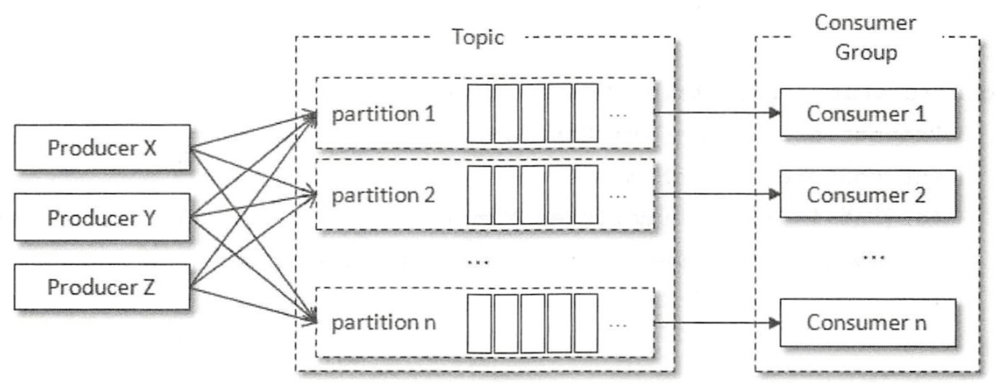

# Kafka

## 概念

### 点对点模型和发布订阅模型

- 点对点模型指，一条消息只能被一个消费者消费，消费完后消息就会被删除

- 发布订阅模型指，一条消息可以被多个消费者消费

### ISR

- 与Leader保持数据同步的副本（可用副本）组成的集合

### OSR

- 与Leader没有保持数据同步的副本组成的集合

### Offset

- broker和consumer都会维护各自的offset。broker的offset表示服务端存储了多少条消息可供消费，消费者端维护的offset表示自己目前消费到的位置

### HW（高水位）

- 表示消费者可以消费的最大消息偏移量（offset），HW本身的位置无法读取到

### LEO（Log End Offset）

- 每个日志文件下一条待写入消息的offset，一般为日志文件最后一条消息的offset加一，分区ISR集合中每个副本都会维护自己的LEO，ISR中最小的LEO即为分区的HW

## Broker


- Kafka集群中每一个节点都叫broker。分为Controller和Follower。他们的区别在于Controller会主动监听存储在Zookeeper中的元数据变化，一旦发生变化，会将元数据同步到本地内存中，同时会同步给其他的Follower节点

- Controller的选举也是通过Zookeeper的临时节点实现的。所有节点刚启动时都会去Zookeeper上创建Controller临时节点，注册成功的即成为Controller，其余的节点自动成为Follower，并监听Controller临时节点。当Controller发生故障时，Controller临时节点会自动删除，触发监听，所有Follower节点又会重新尝试创建Controller临时节点，选举出新的Controller

## 生产者

### 生产者整体架构


- 消息发送主要有两个线程共同工作，即主线程和Sender线程
- 主线程首先将业务数据封装成ProducerRecord对象，然后调用KafkaProducer的send()发送，在send()方法中会先通过所有的ProducerInterceptor链对原始ProducerRecord对象拦截处理，然后依次经过序列化器、分区器，最后将消息放入RecordAccumulator缓冲区
- RecordAccumulator缓冲区主要用来缓存消息以便Sender线程可以批量发送，减少网络传输。RecordAccumulator缓冲区大小通过buffer.memory配置，默认值为32M。如果生产者发送消息速度大于Sender线程发送到服务器的速度，则会导致缓冲区满，这时send()方法会被阻塞，超过max.block.ms配置的时间（默认60s）会抛出异常
- 实际消息发送到Kafka Broker是由另外一个单独的Sender线程负责的。RecordAccumulator内部为每一个分区维护一个Deque（双向队列），即Map<分区,Deque<ProducerBatch>>。这个Map是CopyOnWriteMap，使用了写时复制的方式，应付读多写少场景，提高并发能力。当一条消息进入RecordAccumulator会先查找对应的Deque，没有就创建，然后从尾部获取一个ProducerBatch，没有就创建，如果该ProducerBatch还能写入数据就将消息写入，否则创建一个新的ProducerBatch，在新建ProducerBatch时，如果评估该消息大小不超过batch.size的值，则按照batch.size的值创建（能被BufferPool管理，空间能复用），否则就按照实际评估的大小创建（不会被BufferPool管理，用完后还是会被GC，空间不能复用，实际还是一条消息一条消息发送，批次的设计失去了意义，因此需要根据实际业务需求，调整Batch大小）。Sender获取到Map<分区,Deque<ProducerBatch>>会将其转换成Map<Node,List<ProducerBatch>>，进一步封装成Map<Node,List<ProduceRequest>>
- 保存到InFlightRequests中，InFlightRequests保存的形式为Map<NodeId,Deque<ProduceRequest>>，主要作用为缓存已发送但是没有收到响应的请求。可以设置max.in.flight.requests.per.connection设置每个连接（客户端和Node之间的连接）最多缓存的未响应请求数。可以通过比较指定Node的Deque<ProduceRequest>大小来判断Node的负载，堆积的未响应的请求数越多，负载越大。选择leastLoadedNode发送请求可以避免请求拥塞，比如元数据请求与更新就会挑选leastLoadedNode发送MetaRequest请求来获取元数据信息
- Sender线程最终执行网络IO线程将消息发送出去

### 发送类型

- 同步发送。发送一条消息，需要完成所有后续发送流程，接收到响应后才能继续发送下一条消息，性能很差
  
  ```java
  producer.send(new ProducerRecord<String, String>("DEMO_TOPIC_1", "HELLO WORLD")).get()
  ```

- 异步发送。可以同时发送多条消息，不需要等待上一条消息完成，发送时为每一条消息绑定一个回调函数，消息发送的结果通过回调函数返回处理，性能好
  
  ```java
  //对于同一分区，如果消息1发送先于消息2，那么消息1对应的Callback也会保证先于消息2的Callback执行，即回调函数在分区内也是有序的
  producer.send(new ProducerRecord<String, String>("DEMO_TOPIC_1", "HELLO WORLD"),(md,ex)->{
      if(ex != null){
          throw new RuntimeException(ex);
      }
      System.out.println(String.format("topic:%s,partition:%s,offset:%s", md.topic(),md.partition(), md.offset()));
  });
  ```

### 序列化器

- 所谓序列化就是将自定义的内容按照一定的格式和协议转换成字节数组的过程

- 反序列化就是将字节数组按照一定的格式和协议转换成自定义的内容的过程
  
  #### 自定义序列化和反序列化器
  
  - org.apache.kafka.common.serialization.Serializer
  - org.apache.kafka.common.serialization.Deserializer

- 设置key.serializer、value.serializer、key.deserializer、value.deserializer参数

### 分区器（参考文章https://huagetai.github.io/posts/fabbb24d/）

- 所谓分区策略是决定生产者将消息发送到哪个分区的算法，Topic下每个消息只会被发送到该Topic下某一个分区

- 分区的原因
  
  - 每个单独的分区都必须受限于主机的文件限制，不过一个主题可能有多个分区，可以无限水平扩展
  - 提供负载均衡的能力，增加消息发送的并发能力
  - 利用分区也可以实现其他一些业务级别的需求，比如可以将key设置为用户ID，将同一个用户的数据发送到相同的分区

- 分类
  
  - DefaultPartitioner
    
    - 如果指定partition，则直接发送到指定的partition，如果没有指定partition，但是指定了key，则根据key的hash值（默认是murmurHash2算法）计算partition（所以相同的key会被发到相同的分区）。如果没有指定partition，也没有指定key，则采用UniformStickyPartitioner策略（2.4版本之前采用的是RoundRobinPartitioner）
  
  - RoundRobinPartitioner
  
  - UniformStickyPartitioner
    
    - 主要解决RoundRobinPartitioner下消息延迟的问题。因为生产者发送消息采用批次方式发送，但是如果采用RoundRobinPartitioner策略，每条消息还是会被分散到不同的分区中，导致请求次数太多，请求排队导致更高的延迟。而UniformStickyPartitioner会将该批次的消息发送到同一个分区，直到批次满了或者linger.ms时间到达才会切换分区

- 自定义分区策略
  
  - 实现org.apache.kafka.clients.producer.Partitioner，设置partitioner.class参数

### 拦截器

- 实现client端定制化处理逻辑
- 使用场景
  - 按照某个规则过滤不合法的消息
  - 修改消息内容，比如统一给消息添加前缀
  - 统计消息数据
- 自定义拦截器
  - 实现org.apache.kafka.clients.producer.ProducerInterceptor，并设置interceptor.classes参数

### 生产者参数

- acks
  - 1表示只要分区的Leader副本成功写入消息就会返回成功响应。如果消息写入Leader并返回成功响应给生产者，但是在其他Follower同步完成之前，Leader崩溃，则数据会丢失
  - 0表示发送消息后不再等待服务器响应，消息发送到写入到服务器过程中出现异常，消息就会丢失。0的性能最高，可靠性最差，用于对数据丢失不敏感的场景，比如日志收集，大数据统计等
  - -1或者all表示会等待ISR中所有副本都成功写入后才会成功响应。-1的可靠性最高，但是也不是绝对的可靠，因为当ISR中只剩下Leader时会退化为1的情况，需要更高的可靠性需要配置min.insync.replicas>1
- 

## 消费者

### 消费者组

- 对于同一个消费者组而言，是点对点消费模型，即每一个分区只能被同一个消费者组中的一个消费者消费。所以对于分区数固定的情况，消费者组内的消费者的数量不能超过分区数量，否则就会有消费者分配不到任何分区而白白浪费
- 对于不同消费者组而言，是分布订阅模型，即每一个分区可以被不同的消费者组中的消费者消费
- 消费者分区分配策略通过消费者参数设置partition.assignment.strategy来设置
- 两种极端情况
  - 如果整个系统只有一个消费组，所有消费者都属于同一个组，那么所有消息都会被均衡的分配给每个消费者，每条消息只会被一个消费者消费，相当于点对点模式
  - 如果系统中每一个消费者都是属于不同的组，每个组中只包括自己，那么所有消息都会被广播给所有消费者，相当于发布订阅模式
- 

### 订阅主题和分区

```java
public void subscribe(Collection<String> topics)
public void subscribe(Collection<String> topics, ConsumerRebalanceListener listener)
public void subscribe(Pattern pattern)  
public void subscribe(Pattern pattern, ConsumerRebalanceListener listener)
//订阅指定主题的特定分区
public void assign(Collection<TopicPartition> partitions)
```

### 反序列化器

- 参考生产者的序列化器

### offset提交

- 重复消费和消息丢失
  
  
  
  如果在poll()后立即提交offset，那么当消费到x+5位置时出现异常，重新恢复后，poll()会从x+8位置开始拉取消息，x+5到x+7的**消息丢失**。如果是消费完所有消息后再提交offset，那么当消费到x+5位置时出现异常，重新恢复后，poll()还是会从x+2位置开始拉取消息，x+2到x+4的消息会**重复消费**

- 提交方式
  
  - 自动提交
    
    - 通过消费者参数enable.auto.commit配置，默认为true。自动提交为定期提交，默认提交周期为auto.commit.interval.ms配置，默认为5秒。自动提交也会有重复消费和消息丢失的问题
  
  - 手动提交
    
    ```java
    //同步提交
    public void commitSync()
    public void commitSync(Duration timeout)
    public void commitSync(final Map<TopicPartition, OffsetAndMetadata> offsets)
    //异步提交
    public void commitAsync()
    public void commitAsync(OffsetCommitCallback callback)
    public void commitAsync(final Map<TopicPartition, OffsetAndMetadata> offsets, OffsetCommitCallback callback)  
    ```

- 暂停消费和恢复消费
  
  ```java
  public void pause(Collection<TopicPartition> partitions)
  public void resume(Collection<TopicPartition> partitions)
  ```

- 重置offset
  
  - 当消费者找不到消费位移或位移越界的情况下，会根据消费者客户端参数 auto.offset.reset 的配置来决定从何处开始进行消费，这个参数取值可以是latest、earliest、none。latest表示从分区末尾开始消费消息，earliest表示从分区offset为0位置开始消费消息，none的话，出现查到不到消费位移的时候，既不从最新的消息位置处开始消 费，也不从最早的消息位置处开始消费，此时会报出NoOffsetForPartitionException异常

- 指定offset消费
  
  ```java
  //seek()方法只能重置消费者分配到的分区的消费位置，而分区的分配是在poll()方法的调用过程中实现的。也就是说，在执行seek()方法之前需要先执行一次poll()方法，等到分配到分区之后才可以重置消费位置。可以使用assignment()方法来判定是否分配到了相应的分区，可以配合offsetsForTimes()方法重置基于时间的消费位置。seek()方法也为我们提供了将消费位移保存在外部存储介质中的能力
  public void seek(TopicPartition partition, long offset)
  public void seekToBeginning(Collection<TopicPartition> partitions)
  public void seekToEnd(Collection<TopicPartition> partitions)
  ```

### 再均衡

- 再均衡是指分区的所属权从消费者组内一个消费者转移到另一消费者的行为，使我们可以既方便又安全地删除消费组内的消费者或往消费组内添加消费者

- 在再均衡发生期间的这一小段时间内，消费组会变得不可用，停止读取消息

- 消费者消费完某个分区中的一部分消息时还没有来得及提交消费位移就发生了再均衡操作时会导致**重复消费**问题，可以使用再均衡监听器解决该问题

#### 再均衡监听器

```java
public interface ConsumerRebalanceListener {
  //在消费者停止读取消息之后，再均衡开始之前被调用
    void onPartitionsRevoked(Collection<TopicPartition> partitions);
  //在重新分配分区之后和消费者开始读取消费之前被调用
    void onPartitionsAssigned(Collection<TopicPartition> partitions);
}
```

### 消费者拦截器

- 自定义拦截器
  - 实现org.apache.kafka.clients.consumer.ConsumerInterceptor，并设置interceptor.classes参数

### 多线程消费

- KatkaProducer是线程安全的，然而KafkaConsumer却是非线程安全的 

- 实现方式
  
  - 第一种，每个线程实例化一个 KafkaConsumer 对象，线程并发消费受限于分区数，因为当消费线程多于分区数时，会有线程闲置。优点是每个线程可以按顺序消费各个分区中的消息。缺点是，每个消费线程都要维护一个独立的 TCP 连接 ， 如果分区数和 消费线程数都很大，那么会造成不小的系统开销
    
    

- 第二种，将poll()操作跟业务处理逻辑分离，因为一般而言，poll()操作速度很快，性能瓶颈一般在业务逻辑处理上。优点是具有横向扩展的能力，还可以减少TCP连接对系统资源的消耗，但缺点是对于消息的顺序处理就比较困难
  
  

- 

### 消费者参数

## 主题

- topic是一个逻辑上的概念，并不真实存在，partition和message是真实存在的

### 创建主题

- 每个副本分布在不同broker节点，所以分区的副本数不能超过broker节点总数

### 删除主题

- 如果delete.topic.enable=true
  - 直接彻底删除主题
- 如果delete.topic.enable=false
  - 如果该主题没有使用过，则直接删除
  - 如果使用过，会先将其标记为已删除，等到kafka broker重启后再彻底删除

### 增加分区

- 主题的分区数只能增加，不能减少

### KafkaAdminClient

- 编程方式操作kafka主题

## 分区

- Partition是一个真实存在的概念，在磁盘上一个分区就是一个文件夹，里面所有的消息内容才是这个分区完整的数据

- 单个Partition中数据是有序的，如果Topic有多个Partition，消费数据时不能保证消息的顺序，如果需要严格保证消息消费顺序，需要将Partition设为1，但也仅限于一个消费者组，如果多个消费者组同时对同一个分区消费，依然不能保证消息的顺序

### 副本机制

- 分区为了实现高可用，每一个分区可以创建指定数量的副本分散在不同的节点上，分区副本分为Leader和Follower。消费者只会从Leader节点读写数据，Follower只作为备份。为了使得集群各节点负载均衡，不同分区的Leader会分散到不同节点上。当Leader挂了后会从ISR集合中的节点中重新选举新的Leader。当某一个Follower同步太慢，Leader会将这个Follower从ISR中剔除，重新创建一个Follower

## 高性能、高并发

#### Broker

- Reactor模式、多线程

- log分布式存储，多主题，多分区，提交消息生产和消费的并发能力

- 消息顺序读写磁盘

- 消费消息时，先采用借助跳表的数据结构快速定位到对应的log文件，然后再借助index文件（稀疏索引）快速定位到offset所在的分组，然后再在分组中遍历

- 零拷贝机制

#### Producer

- 发送消息采用批处理发送，并且在追加生产者消息时采用了写时复制的技术，应对读多写少场景。并且使用了分段加锁的方式提升并发性能

- 发送数据采用异步发送，绑定回调函数的方式，提升系统吞吐量

- 发送数据时采用了NIO技术，使用Selector同时管理多个Channel，这样一个客户端可以同时和多个broker通信，并且通过自定义协议解决了TCP拆包黏包问题

- 内存池Buffer Pool设计。发送每一个消息批次前，都会先向Buffer Pool申请一块内存（ByteBuffer）（默认16K），发送完毕后将空间清空后归还回Buffer Pool，类似于连接池设计，从而实现对ByteBuffer的复用，减少了GC发生的频率

- Sender线程在真正发送多个分区的批次数据前，还会将分区Leader副本在同一个broker的请求合并，减少网络IO开销 

#### Consumer

- 消费者组的概念

- 老版本的kafka将消费者消费的offset维护在Zookeeper中，当消费者数量比较多的时候Zookeeper会出现性能瓶颈。新版本的kafka将消费者消费的offset维护在broker的\_consumer_offset主题下

### 高可用

- 通过Zookeeper选举Controller管理元数据，当Controller挂掉可以自动选举出新的Controller

- 分区可以创建副本，来保证数据的高可用

## 常见问题

### 消息重复

#### 生产者端

- 由于producer有重试机制并且设置了retries>1，可能会导致broker消息落盘成功，但因为网络等种种原因producer得到一个发送失败的响应导致重试

- 

#### 消费者端

- offset提交时机，如果是在消费全部消息后再提交offset，那么如果是在消费过程中出现异常，会导致offset没有提交，下一次还是会重复消费前面已消费部分的消息

- 再均衡

#### 解决方案

- 开启broker的幂等性配置enable.idempotence=true，同时要求 ack=all 且 retries>1

- 每次消费完或者程序退出时手动提交

- 在消费端做幂等校验。可以使用数据库的唯一索引，事务来保证数据不重复，也可以使用Zookeeper和Redis的setnx等来保证数据的唯一性

### 消息丢失

#### broker

- unclean.leader.election.enable配置为true，允许选举ISR以外的副本作为leader，会导致数据丢失，默认为false。producer发送异步消息完，只等待leader写入成功就返回了，leader crash了，这时ISR中没有follower，leader从OSR中选举，因为OSR中的数据版本落后于Leader，造成消息丢失

#### 生产者端

- ACK级别设置0或者1，也没有设置重试

- 

#### 消费者端

- offset提交时机，如果是在消费一开始的时候提交offset，再进行消费消息，那么如果是在消费过程中出现异常，会导致offset已提交但是消息没有被处理，这部分消息丢失

#### 解决方案

- 配置ack= -1,tries > 1,unclean.leader.election.enable =false，同时配置min.insync.replicas > 1，指定必须确认写操作成功的最小副本数量

- producer发送消息时，对于一些不可恢复的异常，捕获异常记录到数据库或缓存，进行单独处理

- 关闭offset自动提交，使用手动提交

### 消息顺序

- kafka想要保证消息顺序，是需要牺牲一定性能的，方法就是一个消费者组，消费一个分区，可以保证消费的顺序性。但也仅限于消费端消费消息的有序性，无法保证生产者发送消息有序

- 如果设置max.in.flight.requests.per.connection>1，因为有重试机制，有可能会导致乱序。将max.in.flight.requests.per.connection设置为1，可以解决单个producer消费顺序的问题，但是会影响吞吐量。另外还是无法保证多个producer消费顺序

- 如果一定要保证生产-消费全链路消息有序，发送端需要同步发送，ack回调不能设置为0。且只能有一个分区，一个消费者进行消费，但这样明显有悖于kafka的高性能

### 消息积压

- 因为发送方发送消息速度过快，或者消费方处理消息过慢，可能会导致broker积压大量未消费消息，此种情况可以修改消费端程序，让其将收到的消息快速转发到其他topic(可以设置很多分区，设置合理的分区策略，保证分区消费均衡)，然后再启动多个消费者同时消费新主题的不同分区


## 核心源码

### 生产者


#### Producer初始化

- 根据传入的Properties配置，创建KafkaProducer对象，在其构造器中初始化了大量组件和配置，重要的几个比如：分区器、key、value序列化器、拦截器、集群元数据Metadata、消息批次缓存池RecordAccumulator、网络通信组件NetworkClient、Sender线程

#### send()逻辑


##### 元数据管理

- 生产者默认会每隔5分钟从broker拉取并更新最新的集群元数据，用于后续流程使用

- 在KafkaProducer的send()方法中，会先通过调用waitOnMetadata()方法同步等待拉取元数据，里面真正是由Sender线程执行元数据拉取操作的


- 对key、value序列化，再通过分区器计算出分区，默认的分区器实现是DefaultPartitioner，封装为TopicPartition对象，然后调用RecordAccumulator的append()追加到RecordAccumulator中

##### 消息批次和内存池


- RecordAccumulator是一块默认大小32M的内存池，里面维护了一个CopyOnWriteMap<TopicPartition, Deque<RecordBatch>>的数据结构，使用了copy on write，这里会为每个分区维护一个队列，每个消息会被追加到RecordBatch中，并放入队列，等待Sender线程拉取发送

- 为了提高ByteBuffer复用，设计了BufferPool，类似于数据库连接池思想。使用allocate()申请内存，使用deallocate()归还内存


##### Sender线程

- 首先还是会拉取最新的元数据信息

- 检查RecordAccumulator中的RecordBatch，把符合发送条件（队列满了，超过最大发送超时时间、内存池空间不足等）的RecordBatch所对应的Leader节点返回

- 检查符合发送条件的Leader节点的网络条件是否准备好，如果是第一次，会依次调用NetworkClient的initiateConnect()、connect()，最终会调用java NIO API建立socket连接，监听OP_CONNECT事件，并且为每一个SelectKey关联一个对应的KafkaChannel

- 调用NetworkClient的poll()真正处理与broker建立网络连接，以及消息读写事件，核心处理逻辑在Selector的pollSelectionKeys()方法中。这里会根据不同的事件做不同处理

- producer与broker建立好连接后，在sendProduceRequests()中会将符合发送条件的RecordBatch封装成ClientRequest对象，调用NetworkClient的send()发送，会继续封装为NetworkSend对象、InFlightRequest对象，放入inFlightRequests队列，然后会为对应的Channel绑定OP_WRITE事件

- run()中的死循环会再次调用NetworkClient的poll()，处理OP_WRITE事件，将消息写入Channel发送给broker

- run()中的死循环会再次调用NetworkClient的poll()，处理OP_READ事件，不断接收broker响应消息，会被封装为NetworkReceive对象，同时这里会解决TCP拆包黏包问题，放入一个队列，最后会再次把NetworkReceive中的字节信息解析成为明文数据，封装为ClientResponse数组

- 调用每一个ClientResponse的回调函数，最终会调用到Sender的handleProduceResponse()，completeBatch()，调用每一个RecordBatch的done()，这里面会回调producer异步发送消息时绑定的回调函数

### broker


- kafka broker启动的代码入口在Kafka#main()，程序会先读取解析配置参数，核心逻辑在KafkaServer#startup()，该方法完成了整个broker启动流程

- 初始化Zookeeper配置

- 初始化LogManager对象，LogManager主要是用来读写log文件，以及自动清理过期log

- 初始化SocketServer对象，并调用SocketServer#startup()，在该方法中，会初始化Acceptor线程和Processor线程。其中Acceptor中会调用JDK NIO API，创建ServerSocketChannel，注册到Selector上，同时会添加OP_ACCEPT关注事件。然后会开启一个死循环，不断监听客户端连接请求，如果接收到OP_ACCEPT事件，调用accept(key, processors(currentProcessor))，在该方法中，会调用ServerSocketChannel#accept()处理请求，同时将处理后的socketChannel加入newConnections队列

- 初始化ReplicaManager并调用ReplicaManager#startup()，ReplicaManager主要用来负责管理分区副本

- 初始化KafkaController并调用KafkaController#startup()，KafkaController主要用来管理broker集群，通过Zookeeper选举而来

- 初始化KafkaRequestHandlerPool，这个组件主要是会启动一些KafkaRequestHandler线程，用于后续真正服务端处理IO请求


- 每一个Processor也是一个不断死循环的线程，在其run()中，会不断从newConnections队列中拉取Acceptor线程处理后的socketChannel，然后将其注册到Processor线程组中的一个Processor的Selector上，默认采用轮询策略，同时绑定OP_READ事件

- 同时在Processor#run()中，调用poll()，最终会在pollSelectionKeys()方法对各种读写事件进行处理，对于客户端发来的NetworkReceive请求，会先放入StagedReceives，然后然后再进行处理放入completedReceives


- 同时在Processor#run()中，调用processCompletedReceives()将completedReceives队列中请求数据封装成Request对象，放入requestQueue队列，后续每一个KafkaRequestHandler线程中会不断在从该队列中poll()到请求，并调用KafkaApis#handle()进行请求处理，在该方法中，broker会根据不同的请求类型做不同的处理。处理完请求后，不同的API会将响应结果封装为Response对象，并且放入responseQueues，同时在Processor#run()中，不断调用processNewResponses()将数据写回客户端
