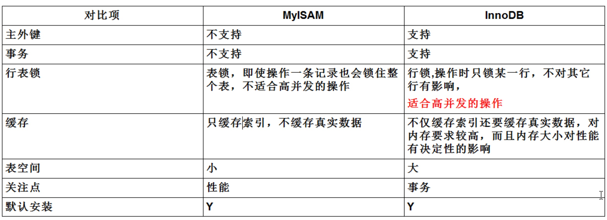
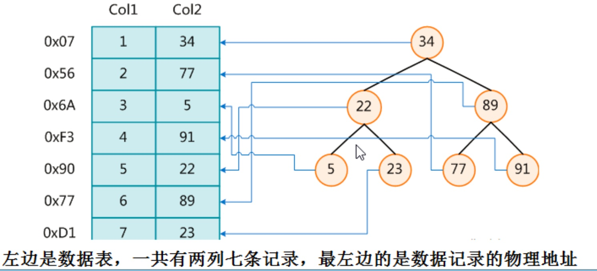

# MySQL学习笔记

## 存储引擎

- 分类
  
  - MyISAM
  - InnoDB

- 比较
  
  
  
  **说明：**
  
  - **MyISAM主要用在读操作，InnoDB主要用于写操作。**
  - **InnoDB相比于MyISAM最大的区别：行级锁和事务支持。**

- 查看当前存储引擎的命令
  
  ```sql
  show engines;  
  show variables like '%storage_engine%';
  ```

## Join

### SQL执行顺序

```sql
(8) SELECT (9)DISTINCT<Select_list>
(1) FROM <left_table> (3) <join_type>JOIN<right_table>
(2) ON<join_condition>
(4) WHERE<where_condition>
(5) GROUP BY<group_by_list>
(6) WITH {CUBE|ROLLUP}
(7) HAVING<having_condtion>
(10) ORDER BY<order_by_list>
(11) LIMIT<limit_number>
```

### 分类


## 索引

- 索引是帮助MySQL高效获取数据的**数据结构**，是**排好序**的**快速查找**数据结构。
  
  除了数据之外，数据库还维护着一个满足特定查找算法的数据结构，这些数据结构以某种方式指向数据，以使得可以高效查找数据。这种数据结构就是索引。
  
  

### 优点

- 提高数据**检索**效率，降低**IO**操作成本。
- 通过索引列对数据进行**排序**，降低排序成本，降低**CPU**消耗。

### 缺点

- 索引会占用空间。
- 索引会加快查询速度，但是会降低DML操作速度。因为DML操作的时候，不仅会修改表的数据，还会更新对应的索引。
- 索引建立是需要通过优化的。

### 分类

#### 根据数据索引是否分离

- 聚集索引（又叫聚簇索引）是指数据和索引放在同一棵B+树，比如Innodb的索引，Innodb主键索引叶子节点数据域存放数据行完整数据，非主键索引叶子节点数据域存放对应行的主键

- 非聚集索引是指数据和索引分开存放，比如MyISAM索引

#### 根据索引列字段个数

- 单值索引
  
  - 每一个索引只包含一个列，一个表可以有多个单值索引

- 唯一索引
  
  - 索引列值必须唯一，但是可以允许有多个NULL

- 复合索引
  
  - 一个索引包含多个列。对多个列建立索引，优先考虑建立复合索引，原因是在同时使用多个字段查询时，可以最大程度的利用索引。
    
    ```sql
    -- 比如给id,name,score三个字段加索引
    -- 创建复合索引(id,name,score)
        -- 相当于建立了三个索引(id),(id,name),(id,name,score)，当where后面同时根据id,name,score查询时，三个字段的索引都能被利用
    -- 如果为三个字段分别创建单列索引
        -- (id),(name),(score),当where后面同时根据id,name,score查询时，MySQL只会使用其中最优的一个字段的索引
    ```

### 数据结构

- 索引结构分为B+树、Hash索引等，主要使用B+树。B+树和二叉树，红黑树比较，存储相同数量索引项，B+树的高度会更小，IO操作次数会更少，查询效率会更高。Hash索引存在Hash冲突和不支持范围查询的问题


- B+树是B树的改进版
  
  - B+树的叶子节点中保存所有索引项，并且按照索引项的顺序排列存储。非叶子结点只保存索引（冗余）
  - 数据查询时，从root节点到叶子节点，依次将节点页加载到内存，采用二分查找，最终定位到查询的数据行
  - MySQL中的B+树是优化后的，在所有叶子节点之间增加链表指针，只要是为了提高范围查询的效率

### Innodb索引

- 主键索引


- 非主键索引


#### 为什么推荐使用递增的整型类型作为主键

- 在构建B+树结构和在索引上查找数据时，整数类型比较速度更快

- B+树额叶子节点是按照顺序维护的，如果插入时不是自增，会导致索引树叶子节点不是按照顺序依次往后追加，索引树结构会发生调整以保持叶子节点的顺序，会带来额外的开销

- 整型类型占用空间较少

#### 复合索引


- 索引树构建时按照复合索引从左往右字段的顺序组织，数据域存放数据行的主键值，每一个索引字段局部有序，全局无序，所以复合索引需要遵循最左前缀匹配原则

### Innodb页结构


- Innodb的页结构主要包含三部分：页头，存放指向前一页和后一页的指针。用户数据区域存放实际的数据行。页目录是为了提高数据行链表查找效率而设置的分组优化

- 实际查找时，会先通过二分查找索引页部分，快速定位到数据页位置，然后再通过二分查找数据页中的目录项，定位到具体的数据行，实现查询

## SQL优化

### SQL性能影响因素

- 查询SQL写的烂
- 索引失效
- 关联太多join
- 服务器参数调优及参数设置（线程数、缓冲大小等）

### MySQL性能瓶颈

- CPU
- IO
- 查看性能状态常用命令：top、free、iostat、vmstat

### SQL优化一般步骤

#### 查看 SQL执行频率

- 使用`show [session|global] status like 'Com%'`可以查看SQL执行频率，Innodb可以使用`show [session|global] status like 'Innodb_rows_%'`

#### 定位低效率SQL

- 慢查询日志，但是只能在查询结束后才会被记录
- show processlist命令可以实时的查看每个客户端执行的慢SQL执行情况

#### Explain分析执行计划

##### 概念

- 查看执行计划。可以使用explain模拟优化器执行SQL语句，知道MySQL是如何执行SQL语句的。分析表结构和SQL语句的性能瓶颈。

- 作用
  
  - 查看表的读取顺序（`id`字段）
  - 数据读取操作的操作类型（`select_type`字段）
  - 哪些索引可能被使用（`possible_keys`字段）
  - 哪些索引实际被使用（`key`字段）
  - 表之间的引用（`ref`字段）
  - 被优化器查询的记录行数（`rows`字段）

##### 执行计划包含内容

  

  各个字段含义：

- `id`
  
  表示select子句或者操作表的顺序。相同的id从上向下执行，不同的id，id越大越先执行。

- `select_type`
  
  查询类型，用来区别简单查询、联合查询、子查询。
  
  - `SIMPLE`：简单select语句，不包含子查询或UNION
  - `PRIMARY`：如果存在子查询，最外面一层标记为PRIMARY
  - `SUBQUERY`：WHERE或SELECT存在子查询部分
  - `DERIVED`：FROM中包含的子查询部分
  - `UNION`：UNION语句中第二个select语句
  - `UNION RESULT`：UNION返回结果的select语句

- `table`
  
  这行数据是来源于哪张表的。

- `partitions`

- `type`
  
  访问类型，一般至少达到`range`及以上。
  
  - `NULL`
    
    不需要扫描索引或者表就可以得到结果。
    
    ```sql
    explain select now(); 
    ```
  
  - `system`
    
    `const`的特例，所查询的表中只有一条记录。
    
    ```sql
    explain select * from (select * from emp where eid=1) t; 
    ```
  
  - `const`
    
    唯一索引扫描，只会匹配一条结果，一般`where`后面使用`primary key`或者`unique index`判断。因为只匹配确定的一行数据，速度很快。
    
    ```sql
    explain select* from emp where eid=1;  
    ```
  
  - `eq_ref`
    
    通常出现在多表的 join 查询，表示对于前表的每一个结果，都只能匹配到后表的一行结果（通过主键或者唯一索引扫描），并且查询的比较操作通常是 =，查询效率较高。
    
    ```sql
    explain select * from a join b on a.id=b.id; 
    ```
  
  - `ref`
    
    非唯一索引扫描，会匹配多条结果，此类型通常出现在多表的 join 查询，针对于非唯一或非主键索引，或者是使用了**最左前缀规则**索引的查询。
  
  - `range`
    
    使用索引范围查询，通过索引字段范围获取表中部分数据记录，性能比全表扫描好。一般是`where`中使用了between、in、<、>、IS NULL的查询。
  
  - `index`
    
    遍历索引树，一般比all要快。因为all是遍历硬盘文件读取数据。当是这种情况时, `Extra` 字段 会显示 `Using index`。
    
    ```sql
    -- id覆盖索引列，只需要遍历索引树即可，不需要遍历数据文件
    explain select id from a;
    ```
  
  - `all`
    
    扫描全表的数据文件。
    
    ```sql
    explain select * from a;
    ```

- `possible_keys`
  
  查询字段上面如果存在索引，会列出，但不一定会实际用到。

- `key`
  
  实际使用的索引。如果为`NULL`，则没有使用到索引。

- `key_len`
  
  索引中使用的字段长度。

- `ref`
  
  显示索引中哪一列被引用了。

- `rows`
  
  找到所需记录需要读取的行数。

- `filtered`

- `Extra`
  
  额外一些重要信息。如`Using filesort`、`Using temporary`、`Using index`等。
  
  ```
  Using filesort：扫描数据文件内容，并对其进行排序，效率低下
  Using temporary：使用临时表存储中间结果
  Using index：使用了覆盖索引
  Using index condition：查询走索引了，但是索引列中只有select中部分字段的数据，其他的数据还需要回表查询
  Using index;Using where：查询使用了索引，并且索引列中已经包含了select所有的列数据，不需要再回表查询
  ```

#### 其它优化

##### 大批量导入数据

- 按主键的顺序导入
- 关闭唯一性校验
- 关闭自动提交事务

##### insert语句优化

- 使用values(),(),()的方式一次性插入
- 保证插入的数据的主键有序
- 关闭事务自动提交，在同一个事务当中插入

##### limit分页

- 如果主键自增，可以使用范围查询+limit y取代直接limit x , y
- 通用方式：先通过索引字段排序并返回分页的id，再通过和主表JOIN关联查询出全部的查询结果

##### SQL提示

- use index
- ignore index
- force index

### 索引优化分析

- 需要建立索引的情况
  
  - 对查询频率高，数据量大的表建立索引
  - 主键自动会创建唯一索引
  - 尽量使用唯一索引，区分度（辨识度）越高，使用索引的效率越高
  - 对辨识度高的字段建立索引
  - 频繁作为查询条件的字段
  - 查询中与其它表关联的字段，外键字段
  - 高并发下优先建立复合索引（相比于单值索引）
  - 排序字段（建立索引的顺序要与排序字段顺序一致）
  - 统计、分组字段

- 不需要建立索引的情况
  
  - 频繁更新的字段
  - where中用不到的字段
  - 表记录太少
  - 数据重复且分布均匀

- 索引分析
  
  - 单表
    
    ```sql
    +----+-------+-------+----------+-------+
    | id | aname | class | comments | level |
    +----+-------+-------+----------+-------+
    | 1  | a1    | 33    | yyyyyy   | 3     |
    | 2  | a2    | 11    | xxxxxx   | 2     |
    | 3  | a1    | 44    | zzzzzz   | 4     |
    | 6  | a2    | 55    | oooooo   | 4     |
    +----+-------+-------+----------+-------+
    select * from a where aname='a2' and level>2 order by class;
    1.不建立任何索引
    +----+-------------+-------+------+---------------+--------+---------+--------+------+-----------------------------+
    | id | select_type | table | type | possible_keys | key    | key_len | ref    | rows | Extra                       |
    +----+-------------+-------+------+---------------+--------+---------+--------+------+-----------------------------+
    | 1  | SIMPLE      | a     | ALL  | <null>        | <null> | <null>  | <null> | 4    | Using where; Using filesort |
    +----+-------------+-------+------+---------------+--------+---------+--------+------+-----------------------------+
    结论：type为ALL，并且出现Using filesort。
    2.创建复合索引
    create index idx_a_aname_level_class on a(aname,level,class);  
    +----+-------------+-------+-------+-------------------------+-------------------------+---------+--------+------+-----------------------------+
    | id | select_type | table | type  | possible_keys           | key                     | key_len | ref    | rows | Extra                       |
    +----+-------------+-------+-------+-------------------------+-------------------------+---------+--------+------+-----------------------------+
    | 1  | SIMPLE      | a     | range | idx_a_aname_level_class | idx_a_aname_level_class | 16      | <null> | 1    | Using where; Using filesort |
    +----+-------------+-------+-------+-------------------------+-------------------------+---------+--------+------+-----------------------------+
    结论：使用索引idx_a_aname_level_class，type优化为range，但是还是存在Using filesort。
    原因是根据最左匹配，aname和level使用到索引，但是由于level是范围，致使后面的字段的索引全部失效，所以class没有使用索引，只能通过filesort排序。
    3.重新创建复合索引
    create index idx_a_aname_class on a(aname,class); 
    +----+-------------+-------+------+-------------------+-------------------+---------+-------+------+-------------+
    | id | select_type | table | type | possible_keys     | key               | key_len | ref   | rows | Extra       |
    +----+-------------+-------+------+-------------------+-------------------+---------+-------+------+-------------+
    | 1  | SIMPLE      | a     | ref  | idx_a_aname_class | idx_a_aname_class | 12      | const | 2    | Using where |
    +----+-------------+-------+------+-------------------+-------------------+---------+-------+------+-------------+
    结论：type为ref，且没有filesort。
    ```
  
  - 两表
    
    联合join查询中，left join索引加在右表上，right join索引加在左表上。比如，left join，左表数据全部保留，所以关注点主要在右表。right join同理。
  
  - 三表
    
    遵循两表的原则。
    
    ```sql
    select * from a left join b on a.x=b.x left join c on c.x=b.x;
    -- 在b字段和c字段上添加索引
    ```
  
  - ORDER BY
    
    - MySQL排序有2种：filesort和index。前者性能较差，后者性能较好。所有不是利用索引天然有序特性，直接返回有序结果的排序方式都叫filesort，通过索引查询直接返回有序数据的方式叫index，不需要额外排序，效率较高
    
    - ORDER BY使用index排序的条件：
      
      - ORDER BY字段符合最左匹配原则。
      - ORDER BY字段和where字段组合起来符合最左匹配原则。
      - ORDER BY默认采用升序，ORDER BY后面各字段的排序规则需要统一，要不全部升序，要不全部降序，否则会出现filesort。
    
    - filesort有两种算法
      
      - 双路算法
        
        - 2次IO操作
      
      - 单路算法
        
        - 会将所有字段取出，在sort_buffer中1次排序IO操作，内存占用空间比双路要大。缺点是，如果sort_buffer不够大，会导致需要取多次才能完成排序，IO次数反而比双路算法更多。
        - 因此，**使用order by不要使用select ***，因为select *会将所有字段取出，更容易使sort_buffer空间占满，导致多次IO操作。
    
    - 优化方案
      
      - 增大`sort_buffer_size`
      - 增大`max_length_for_sort_data`
  
  - GROUP BY
    
    - 参考ORDER BY
    - GROUP BY底层默认也会执行排序操作，如果想要避免排序的开销，可以加上`order by null`
  
  - 子查询
    
    - 尽量使用更高效的JOIN代替子查询
  
  - 结论
    
    - **永远小结果集驱动大结果集，减少外层循环总次数 。**
      
      ```sql
      select * from A where id in (select * from B);❶
      -- exists作用是，将前面的结果查出，并依次使用后面的条件过滤，保留结果为true的数据。
      select * from A where exists(select 1 from B where A.id=B.id);❷
      -- 结论：
      -- ❶语句中B表驱动A表，当A的数据量大于B时，性能比❷好。
      -- ❷中A驱动B，当A的数据量小于B时，性能比❷好。
      ```
    
    - 优先优化内层循环。
    
    - 保证join语句中被驱动表的join条件字段被索引。
    
    - 适当设置join buffer。 

- 避免索引失效
  
  - 全值匹配（个数和顺序）
    
    - 创建的索引中的列和实际查询时where中的列个数和顺序完全匹配
  
  - **最佳左前缀匹配**，仅限于复合索引判断，单列索引不存在这个问题
    
    - **索引包含多列时，查询要从索引最左边列开始并且不要跳过索引中的列。**
    - where后面的字段顺序不影响索引生效，SQL优化器会自动优化为索引的顺序
  
  - 不要在索引列上做任何运算或者（显示或者隐式）类型转换，否则会导致索引失效全表扫描。需要注意的是，是索引列发生类型转换会导致索引失效，查询条件的值发生类型转换并不会索引失效
    
    ```sql
    -- 假设a字段是int类型，b字段是varchar类型
    -- MySQL中如果判断条件左右两边类型不一致，会发生从字符串转为数字的逻辑。
    -- 任意非纯数字的字符串都会转为数字0，纯数字字符串会转为对应数字值
    
    -- 索引不会失效，因为是'1'转为1，字段a并没有发生类型转换，依然可以走索引
    select * from table where a='1';
    -- 索引会失效，因为是b字段的类型隐式转换为数字，相当于在索引字段上发生了计算，无法走索引
    select * from table where b=1;
    ```
  
  - 存储引擎不能使用**索引中范围条件右边的列**。
    
    ```sql
    -- 建立索引 idx_name_age_score
    -- 只有name和age索引生效，score不走索引
    explain select * from where name=xxx and age>xxx and score
    ```

- 尽量使用**覆盖索引**，避免使用select *，尽量保证**查询列和索引列一致或者是索引列的子集**，可以直接从索引列上直接返回数据，不需要再额外回表查询。
  
  ```sql
  explain select * from a where aname='a2' and level>=4; 
  -- 修改为
  explain select aname,level,class from a where aname='a2' and level>=4; 
  -- 后
  -- type由range变为ref
  ```

- 字符串可以考虑使用**前缀索引**，减少索引的占用空间，但是前缀索引不能使用order by和group by，也不能使用覆盖索引。因为前缀索引树的构建只是使用了索引字段值的一部分，并不是完整的值，而order by，group by都是根据完整的值排序分组的，另外覆盖索引也只能从索引树上获取到索引字段不完整的数据，所以还是得回表查询完整的数据

- 使用不等于(!=或者<>)索引会失效

- in会走索引，not in索引失效

- 用or连接的多个查询条件，只要有一个没有走索引，那么所有的条件都不会走索引。并且or的条件不能使用复合索引（索引中最左列的字段可以使用），需要创建对应的单列索引。可以使用union操作代替or条件

- like中通配符**%开头**索引也会失效（如果一定要使用%开头，可以使用**覆盖索引**，遍历索引树来查询，避免ALL全表扫描）
  
  ```sql
  explain select * from a where aname='a2';                                                            
  +----+-------------+-------+------+-------------------------+-------------------------+---------+-------+------+-------------+
  | id | select_type | table | type | possible_keys           | key                     | key_len | ref   | rows | Extra       |
  +----+-------------+-------+------+-------------------------+-------------------------+---------+-------+------+-------------+
  | 1  | SIMPLE      | a     | ref  | idx_a_aname_level_class | idx_a_aname_level_class | 12      | const | 2    | Using where |
  +----+-------------+-------+------+-------------------------+-------------------------+---------+-------+------+-------------+
  explain select * from a where aname like 'a2%';                                                      
  +----+-------------+-------+-------+-------------------------+-------------------------+---------+--------+------+-------------+
  | id | select_type | table | type  | possible_keys           | key                     | key_len | ref    | rows | Extra       |
  +----+-------------+-------+-------+-------------------------+-------------------------+---------+--------+------+-------------+
  | 1  | SIMPLE      | a     | range | idx_a_aname_level_class | idx_a_aname_level_class | 12      | <null> | 2    | Using where |
  +----+-------------+-------+-------+-------------------------+-------------------------+---------+--------+------+-------------+
  explain select * from a where aname like '%a2';                                                      
  +----+-------------+-------+------+---------------+--------+---------+--------+------+-------------+
  | id | select_type | table | type | possible_keys | key    | key_len | ref    | rows | Extra       |
  +----+-------------+-------+------+---------------+--------+---------+--------+------+-------------+
  | 1  | SIMPLE      | a     | ALL  | <null>        | <null> | <null>  | <null> | 4    | Using where |
  +----+-------------+-------+------+---------------+--------+---------+--------+------+-------------+
  explain select aname from a where aname like '%a2';                                                  
  +----+-------------+-------+-------+---------------+-------------------------+---------+--------+------+--------------------------+
  | id | select_type | table | type  | possible_keys | key                     | key_len | ref    | rows | Extra                    |
  +----+-------------+-------+-------+---------------+-------------------------+---------+--------+------+--------------------------+
  | 1  | SIMPLE      | a     | index | <null>        | idx_a_aname_level_class | 28      | <null> | 4    | Using where; Using index |
  +----+-------------+-------+-------+---------------+-------------------------+---------+--------+------+--------------------------+
  ```

- 如果MySQL评估使用索引比全表扫描速度更慢，不使用索引。比如某一列数据中，某一个值远远大于其他的值，那么查询时会直接全表扫描

- is(not) null要取决于该字段中NULL和NOT NULL的值的比例，根据上一条规则，如果NULL的值远远大于NOT NULL的值，那么is NULL不会走索引，is not null会走索引。反之同理

- 其它
  
  - 索引范围内，定值条件不同顺序不影响索引使用。MySQL会自动优化。如果出现范围条件，则范围前面的会用到索引，后面的不会使用索引。
    
    ```sql
    -- 比如：
    create index idx_a_aname_level_class on a(aname,level,class);
    -- 以下两条SQL，class，aname，level都会使用到该索引
    explain select * from a where class='55'and aname='a2' and level=4; 
    explain select * from a where aname='a2' and class='55' and level=4;
    -- 只有aname，level使用索引
    explain select * from a where aname='a2' and level>3 and class='55';
    -- MySQL会先做优化，将索引顺序改成aname，level，class，都会使用索引
    explain select * from a where aname='a2' and class>='55'and level=4 ;
    -- aname会用到索引查找，level会用到索引排序
    explain select * from a where aname='a2' and class='55' order by level; 
    -- aname会用到索引，但是会出现Using filesort，因为level断了
    explain select * from a where aname='a2'order by class; 
    -- order by顺序和索引不一致，出现Using filesort
    explain select * from a where aname='a2'order by class,level;
    -- 尽管order by顺序和索引不一致，但是level是一个常量，所以不会出现Using filesort
    explain select * from a where aname='a2' and level=1 order by class,level; 
    -- group by类比order by，aname会用到索引，level,class会排序，不用出现Using filesort
    explain select * from a where aname='a2' group by level,class;
    -- 会出现Using temporary; Using filesort
    explain select * from a where aname='a2' group by class,level; 
    -- level是一个常量，不会出现Using temporary; Using filesort
    explain select * from a where aname='a2' and level=1 group by class,level;  
    -- %放在右侧并不会导致索引链断开，所以class，aname，level都会使用到该索引
    explain select * from a where aname like 'a%' and class='55'and level=4;
    ```

### 查询截取分析

#### 总体思路

- 慢查询开启捕获
- `explain`+慢查询分析
- `show profile`查询SQL的生命周期和执行细节
- MySQL服务器参数调优

#### 慢查询

- 记录超过`long_query_time`的SQL语句。默认10s。

- 开启关闭功能。默认关闭，因为开启慢查询会带来性能影响。
  
  ```sql
  -- 查看
  show variables like '%slow_query%'
  -- 开启（只对当前数据库生效，要永久生效需要配置在my.cnf）
  set global slow_query_log=1; 
  -- 查看最大容忍时间
  show variables like '%long_query_time%';  
  -- 设置最大容忍时间
  set global long_query_time=5;
  -- 查看慢查询总条数
  show global status like '%Slow_queries%';
  ```

- `mysqldumpslow`工具使用

#### show profiles

- 默认关闭，使用时需要开启。

```sql
-- 是否支持该功能
select @@have_profiling;
-- 是否开启
select @@profiling; 
show variables like '%profiling%'; 
set profiling=on;
show profiles;
show profile all for query 2; 
```

- 主要关注一下指标：
  - converting heap to myisam
  - creating tmp table
  - copying to tmp table on disk
  - locked

#### trace分析优化器执行计划

#### 全局查询日志

- 开启后将会记录所有执行过的SQL语句，不要在生产环境使用。

```sql
show variables like '%general_log%';
set global general_log=1;
set global log_output='TABLE';
```

## 其它优化

### 应用优化

- 使用数据库连接池
- 减少数据库重复访问
- 采用主从复制、读写分离架构
- 采用分布式数据库架构
- 考虑引入其他存储中间件，比如引入redis缓存热点数据，使用ES等全文检索服务，将非核心数据放入MongoDB等数据库提高插入查询效率

### 查询缓存优化

- 当开启MySQL查询缓存后，当执行完全相同的SQL语句（字母大小写敏感）时候，会将查询结果缓存，当表的数据发生修改后（包括insert、update、delete、alter table、drop table、truncate table、drop database等），查询缓存失效，不适合修改操作很频繁的表

- 指令
  
  ```sql
  -- 查看当前MySQL是否支持查询缓存
  SHOW VARIABLES LIKE 'have_query_cache';
  -- 是否开启查询缓存
  SHOW VARIABLES LIKE 'query_cache_type';
  -- 查询缓存大小
  SHOW VARIABLES LIKE 'query_cache_size';
  -- 查看查询缓存的状态
  SHOW STATUS LIKE 'Qcache%';
  -- 主要关注以下指标
  -- Qcache_hits 缓存命中数
  -- Qcache_inserts 添加到查询缓存的查询数
  -- Qcache_not_cached 未缓存的查询数
  
  -- 在my.cnf中开启查询缓存
  query_cache_type=1
  ```

- 可以通过SQL_CACHE和SQL_NO_CACHE设置SQL是否缓存

- 查询缓存失效
  
  - SQL语句不一致
  - 查询语句中有一些不确定的函数或者值，比如now(),rand(),uuid()等
  - 不使用任何表查询语句，如 select 1;
  - 查询mysql，information_schema，performance_schema等内置数据表时，不会走查询缓存
  - 如果表数据发生改变，则该表的所有查询缓存都会失效并删除

### InnoDB内存优化

- innodb_buffer_pool_size
- Innodb_log_buffer_size

### 并发参数优化

- max_connections，最大连接数，如果connection_errors_max_connections不为零并且一直增长可以考虑增大该值
- back_log，请求积压堆栈大小
- Table_open_cache
- Thread_cache_size
- Innodb_lock_wait_timeout

### 锁优化

- 尽可能所有数据查询，以及更新操作都通过索引完成，避免行锁升级为表锁
- 合理设计索引，缩小锁的范围
- 减少索引范围条件的涉及范围，避免间隙锁带来的性能开销
- 尽可能使用低级别事务隔离级别
- 尽量控制事务的大小，在使用Spring事务管理时，事务操作的最前面尽量不使用远程调用等比较耗时的操作，因为**Spring事务管理的方法一开始执行就会开启数据库连接，一直占用直至方法执行结束**，大量耗时操作会占用数据库连接资源。如果要使用，设置超时时间。update语句尽量放后面，insert，delete语句放前面

### 事务优化

- 选择合适的事务隔离级别，比如要保证高并发，注重性能，可以使用RC，对数据一致性要求比较高的可以使用RR

- 事务中避免远程调用，同时远程调用需要设置超时时间

- 将大事务拆分成多个小事务

- update操作尽量放在事务的后面执行，delete和insert操作放在前面执行 。因为update操作会有行锁，与其他事务锁竞争的概率高，而delete和insert操作虽然也会有锁，但是锁竞争的概率很低

- 不使用数据库自带的事务机制，应用侧手动保证数据一致性

## 锁

### 分类

- 读锁和写锁
  
  - 多个读锁可以同时进行，不会相互影响。
  - 一个写操作完成之前会阻塞所有其他的读操作和写操作。

- 行锁和表锁
  
  - 表锁
    
    偏向MyISAM引擎，开销小，加锁快，不会出现死锁。锁粒度大，锁冲突概率大，并发度低。适合读操作多的场景。
  
  - 行锁
    
    偏向InnoDB引擎，开销大，加锁慢，锁粒度小，锁冲突概率小，并发度高。适合写操作多的场景。

### MyISAM表锁

```sql
-- 查看表加锁情况
show open tables; 
-- 给x表加写锁，a表加读锁
lock table x write, a read; 
-- 释放锁
unlock tables;
```

- 读锁
  
  ```sql
  session1：
  lock table a read; 
  -- 成功，可以读a表
  select * from a;
  -- 报错，解锁之前不能操作其它表
  select * from b;
  -- 报错，解锁之前不能修改加读锁的表
  update a set level=4 where id=6;
  
  session2：
  -- 成功，可以读a表
  select * from a;
  -- 成功，可以读其它表
  select * from b;
  -- 会阻塞，直至session1释放read锁
  update a set level=4 where id=6;
  ```

- 写锁
  
  ```sql
  session1：
  lock table a write; 
  -- 成功，可以读a表
  select * from a;
  -- 报错，解锁之前不能操作其它表
  select * from b;
  -- 成功，可以修改a表
  update a set level=4 where id=6;
  
  session2：
  -- 阻塞，直至session1释放write锁 
  -- 会有缓存，测试时更换id
  select * from a where id=4;
  -- 成功，可以读其它表
  select * from b;
  -- 会阻塞，直至session1释放write锁
  update a set level=4 where id=6;
  ```

### InnoDB行锁

- 对于DML语句，Innodb会自动添加排他锁，对于SELECT语句，默认不会加任何锁

- 可以显式给SELECT语句添加共享锁或者排他锁
  
  ```sql
  select * from t where ... LOCK IN SHARE MODE
  select * from t where ... FOR UPDATE
  ```

```sql
-- 查看行锁状态
show status like '%row_lock%';
```

```sql
session1：
insert into y value(1,'y1'),(2,'y2');
begin;
update y set yname='y3' where id=1; 
session2：
-- 阻塞，直至session1 commit
update y set yname='y4' where id=1;
-- 不会阻塞
update y set yname='y4' where id=2;
```

- 需要注意：
  
  - InnoDB行锁是通过给索引上的索引项加锁来实现的，**只有通过索引条件检索数据，InnoDB才使用行级锁，否则，行锁会升级成为表锁**。
    
    ```sql
    +----+-------+
    | id | yname |
    +----+-------+
    | 1  | 1     |
    | 2  | 2     |
    +----+-------+
    session1：
    begin;
    update y set id=3 where yname=1;
    session2：
    -- 会阻塞，因为session1中yname=1出现了隐式格式转换，导致行锁升级成为表锁。
      update y set id=4 where yname=2;
    ```

#### 间隙锁


- 表中已经存在的数据行索引字段值中间非连续区间称为间隙。比如上图表中，(3,10)，(10,20)，(20,正无穷)就是间隙

- 当一个事务执行带范围条件的update语句时，**这个条件范围中的记录行，以及这些记录行所在的间隙内所有记录行**都会被上锁，而不管这些个记录行目前在表中存不存在，其他事务无法对这些个数据行做任何插入修改操作

- 间隙锁只在RR级别下才会生效

#### 乐观锁和悲观锁

        -- 悲观锁
        -- 适合写操作多的场景
        begin;
        select * from TABLE where id = 1 for update;
        update TABLE set value=1 where id = 1;
        commit;
    
        -- 乐观锁
        -- 适合读操作多的场景
        -- 默认不加锁
        select id,value,version from TABLE where id=#{id}
        begin;
        update TABLE
        set value=2,version=version+1
        where id=#{id} and version=#{version};
        commit;

## 事务

### ACID

### 并发事务问题

- 数据覆盖，多个事务修改同一行数据，后面的事务会覆盖前面事务的数据
- 脏读，一个事务使用了另一个事务还未提交的数据
- 不可重复读，对于在同一个事务中读取**同一个数据**，多次读取的结果不一样，主要是指因为其它事务对数据做了修改导致的
- 幻读，对于**同一个查询条件**查询得到的结果不一样，主要是指因为其它事务对数据做了新增导致的

### 事务隔离级别

- 读未提交
- 读已提交，通过MVCC机制保证
- 可重复读，通过MVCC机制保证
- 串行化，通过加锁保证

### MVCC

- MVCC机制主要是为了在读写并发的情况下，不需要通过加锁来保证数据一致性，保证一定的事务隔离级别，提高读写并发能力

- MySQL会为每一张表增加trx\_id和db\_roll\_ptr字段，并且会记录每一行数据的版本记录，组成一个undo log版本链

- 在RC隔离级别下，每一次快照读都会生成一个全新的ReadView规则，然后遍历数据行的版本链依次与ReadVIew中的规则比较，直到找到第一个匹配条件的数据并返回，因为每次快照读都会生成新的规则，所以会有不可重复读的问题

- 而在RR隔离级别下，只有第一次快照读会生成一个ReadView规则，当前事务后续的快照读都会复用该ReadView，所以解决了不可重复读的问题。但是在RR隔离级别下，如果是两次连续的快照读中间执行了当前读操作，会导致重新生成新的ReadView，从而导致幻读的问题

### Buffer Pool


#### 结构

- Innodb在内存中开辟的一块空间，默认大小为128M，用来缓存查询的页数据，在执行update操作时，也是对Buffer Pool中的页数据进行修改，后续再使用单独一个后台线程将脏页同步会磁盘，减少磁盘IO开销

- Buffer Pool另外维护着三个管理用的链表结构，free链表、flush链表、lru链表。其中，free链表记录Buffer Pool中空闲的区域，flush链表记录Buffer Pool中被修改过的区域，lru链表用来Buffer Pool空间使用完毕后淘汰最少使用的区域

#### Redo Log

- 执行更新操作时，Innodb会将Buffer Pool中的对应的页数据进行修改，同时会生成一条对应的Redo Log，并放入Log Buffer，当执行commit时，会将Redo Log持久化。之所以采用生成并持久化Redo Log方式，而不是直接将修改的页数据持久到磁盘，是因为Redo Log的持久化是采用顺序IO方式，效率很高，而如果直接将页数据持久化到磁盘是随机IO，效率很低。Innodb在MySQL启动的时候提前就在磁盘上开辟了两块连续的空间logfile后续存储Redo Log使用。这两块空间会重复循环使用，如果两块空间都满了，这时又有新生成的Redo Log，这时候会触发checkpoint，MySQL会强制将logfile中还未持久化的页从Buffer Pool持久化到磁盘

#### Undo Log

- 在执行update的操作时生成，保存修改前的数据，用于rollback后回滚数据使用

#### Bin Log

- 结构和Redo Log类似，都是用来记录DML操作日志的。只是Redo Log是Inndodb特有的，Bin Log是MySQL Server的功能，主要用来主从同步

#### 双写buffer


- 位于磁盘中，主要是为了防止Buffer Pool数据页持久化到磁盘过程中发生意外导致数据部分写入失败的情况。有了双写buffer可以保证页数据持久化不会丢失数据

#### Change Buffer

- 为了提高update操作效率，执行update语句时，只加载并修改数据页，不加载更新索引页，减少磁盘IO，同时将update语句缓存在Change Buffer中。后续如果有查询操作使用到该索引页，再从Change Buffer中取出缓存的update语句，并更新索引页放入Buffer Pool

## 主从复制

### 原理


- 当从节点连接主节点时，主节点会创建一个log dump 线程，用于发送bin-log的内容。在读取bin-log中的操作时，此线程会对主节点上的bin-log加锁，当读取完成，甚至在发送给从节点之前，锁会被释放。
- 当从节点上执行`start slave`命令之后，从节点会创建一个I/O线程用来连接主节点，请求主库中更新的bin-log（从指定日志文件file的指定位置position之后的日志内容）。I/O线程接收到主节点binlog dump 进程发来的更新之后，保存在本地relay-log中，并将读取到的binary log文件名和位置保存到master-info 文件中，以便在下一次读取时回复master。
- SQL线程负责定时读取relay log中的更新内容，解析成具体的操作并执行，最终保证主从数据的一致性。