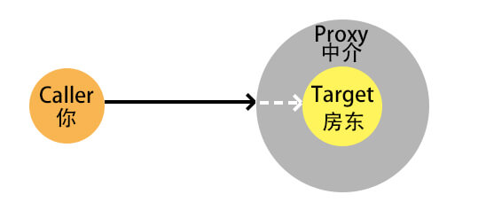
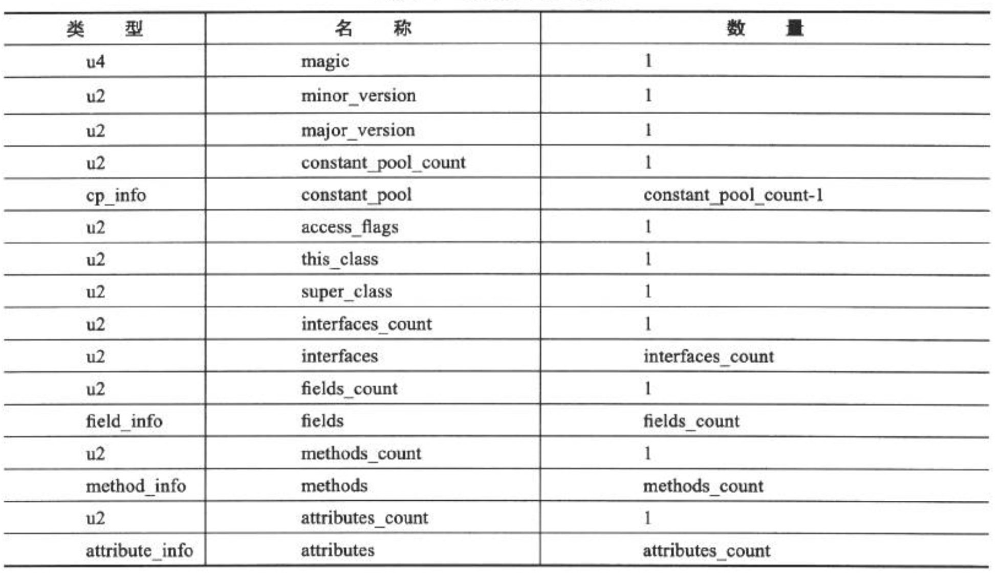

# Java动态代理模式的奥秘

> 👉本文中所有的代码和运行结果都是在amazon corretto openjdk 1.8环境中的，如果你不是使用该环境，可能会略有偏差。另外为了代码看起来清晰整洁，将所有代码中的异常处理逻辑全部拿去了。

## 一些废话

哈喽，各位读者您们好，好久不见！距离上一篇我写的文章已经半个月有余，没办法，我也是菜鸟一枚，而且我写文章有原则，每一篇都必须要酝酿得够深刻，高质量，能够直击灵魂深处......如果只是浅尝辄止我宁可不浪费这时间，而且有些内容我也不会正在学习中，所以我输出的频率必然是低的，但是质量必然是高的。😎不废话，下面开始我们今天的主题。

今天我要跟大家聊的是Java当中的动态代理模式。相信每一个学过Java的朋友，只要是对GOF23设计模式有简单了解过的，或者看过我github上面以前学习时记的笔记，或多或少是听说过代理模式的。这一模式可以说是GOF23所有设计模式中应用最广泛，但又最难以理解的一种模式，尤其是其中的动态代理模式，但是其功能之强大，应用场景之广自然就体现出其重要性。有些场景要是没有使用这一模式，就会变得很难实现。可以这么说，我所了解过的或者阅读过源码的开源框架，底层几乎没有不用到代理模式的，尤其是接下去本文要说的重点-动态代理模式。因此，在文章的最后，我也会以一个在mybatis底层使用动态代理模式解决的经典场景作为本文结束。

## 代理

首先，我们先来说说代理。何为代理？来看张图。这就是我们日常租房的场景，客户来一个陌生城市需要租一个房子，但是他人生地不熟，根本不知道行情，也不知道地段，更没有房东的联系方式，所以，他会去找类似我爱我家之类的租房中介，而这些个中介手上会有大量房子的信息来源，自然会有个房东的联系方式，进而和房东取得联系，从而达到租房的目的。这个场景就是一个经典的代理模式的体现。



## 静态代理

既然说到动态代理，自然联想到肯定会有静态代理。下面我们就先从简单的开始，以上面租房的这个例子，用Java代码实现静态代理。

首先在代理模式（甭管静态还是动态）结构中，肯定会有一个真实角色（Target），也是最后真正执行业务逻辑的那个对象，比如上图中的房东（因为最后租的房子所有权是他的，也是和他去办租房合同等手续），另外会有一个代理角色（Proxy），比如上图中的房产中介（他没有房产所有权），并且这个角色会必然实现一个与真实角色相同的抽象接口（Subject），为什么呢？因为虽然这个出租的房子不是他的，但是是经他之手帮忙牵线搭桥出租出去的，也就是说，他和房东都会有出租房产的行为。另外代理角色会持有一个真实角色的引用，又是为什么呢？因为他并不会（或者是不能）真正处理业务逻辑（因为房子不是他的呗），他会将真正的逻辑委托给真实角色处理。但是这个代理角色也不是一无是处，除了房子不是他的，但是他还可以给你干点跑腿的工作嘛，比如帮你挑选最好的地段，挑选合适的价格等等，等你租房后出现漏水，或者电器啥的坏了可以帮你联系维修人员等等。如下代码所示：

```java
//公共抽象接口 - 出租的人
public interface Person {
    void rent();
}

//真实角色 - 房东
public class Landlord implements Person{
    public void rent() {
        System.out.println("客官请进，我家的房子又大又便宜，来租我的吧...");
    }
}

//代理角色 - 房产中介
public class Agent implements Person{
    Person landlord;

    public Agent(Person landlord) {
        this.landlord = landlord;
    }

    public void rent() {
      	//前置处理
        System.out.println("经过前期调研，西湖边的房子环境挺好的...");
      	//委托真实角色处理
        landlord.rent();
      	//后置处理
        System.out.println("房子漏水，帮你联系维修人员...");
    }
}

//客户端
public class Client {
    public static void main(String[] args) {
        Person landlord = new Landlord();
        Person agent = new Agent(landlord);
        agent.rent();
    }
}

//输出结果：
经过前期调研，西湖边的房子环境挺好的...
客官请进，我家的房子又大又便宜，来租我的吧...
房子漏水，帮你联系维修人员...
```

静态代理模式实现相对比较简单，而且比较好理解，也确实实现了代理的效果。但是很遗憾，几乎没有一个开源框架的内部是采用静态代理来实现代理模式的。那是为什么呢？原因很简单，从上面这个例子可以看出，静态代理模式中的真实角色和代理角色紧耦合了。怎么理解？

下面来举个例子帮助理解静态代理模式的缺点，深入理解静态代理的缺点对于理解动态代理的应用场景是至关重要的。因为动态代理的诞生就是为了解决这一问题。

还是以上面的租房的场景，假设我现在需要你实现如下需求：有多个房东，并且每个房东都有多套房子出租，你怎么用Java设计？按照上面的静态代理模式的思路，你也许会有如下实现（伪代码），

第一种方案：

```java
public class Landlord01 implements Person{
    public void rent01() { ... }
  	public void rent02() { ... }
  	public void rent03() { ... }
}

public class Landlord02 implements Person{
    public void rent01() { ... }
  	public void rent02() { ... }
  	public void rent03() { ... }
}

public class Landlord03 implements Person{
    public void rent01() { ... }
  	public void rent02() { ... }
  	public void rent03() { ... }
}

... 可能还有很多房东，省略

public class Agent01 implements Person{
    Person landlord01;
    //省略构造器等信息
    public void rent() {landlord01.rent();}
}
public class Agent02 implements Person{
    Person landlord02;
    //省略构造器等信息
    public void rent() {landlord02.rent();}
}
public class Agent03 implements Person{
    Person landlord03;
    //省略构造器等信息
    public void rent() {landlord03.rent();}
}

...
```

上面这种方案是为每个房东配一个对应的中介处理租房相关事宜。这种方案问题非常明显，每一个真实角色都需要手动创建一个代理角色与之对应，而这些代理类的逻辑有可能都是很相似的，因此当真实角色数量非常多时，会造成代理类数量膨胀问题和代码重复冗余，方案不可取。

第二种方案：

```java
public class Landlord01 implements Person{
    public void rent01() { ... }
  	public void rent02() { ... }
  	public void rent03() { ... }
}

public class Landlord02 implements Person{
    public void rent01() { ... }
  	public void rent02() { ... }
  	public void rent03() { ... }
}

public class Landlord03 implements Person{
    public void rent01() { ... }
  	public void rent02() { ... }
  	public void rent03() { ... }
}

public class Agent implements Person{
    Person landlord01;
  	Person landlord02;
  	Person landlord03;
    //省略构造器等信息
    public void rent01() { ... }
   	public void rent02() { ... }
   	public void rent03() { ... }
}
```

第二种方案只创建一个代理角色，同时代理多个真实角色，这看上去貌似解决了第一种方案的弊病，但是同时引入了新的问题。那就是造成了代理类的膨胀。设计模式中有条重要原则——单一职责原则。这个代理类违反了该原则。当这个代理类为了代理其中某个真实角色时，需要将所有的真实角色的引用全部传入，显然太不灵活了。还是不可取。

而且有没有发现静态代理还有两个很大的问题，第一，当抽象接口一旦修改，真实角色和代理角色必须全部做修改，这违反了设计模式的开闭原则。第二，每次创建一个代理角色，需要手动传入一个已经存在的真实角色。但是在有些场景下，我们可能需要在并不知道真实角色的情况下创建出指定接口的代理。

## 动态代理

前面做了这么多铺垫，终于今天本文的主角——动态代理模式要登场了。此处应该有掌声......👏而动态代理模式的产生就是为了解决上面提到的静态代理所有弊病的。

JDK动态代理的实现关键在于`java.lang.reflect.Proxy`类，其`newProxyInstance(ClassLoader loader,Class<?>[] interfaces, InvocationHandler h)`方法是整个JDK动态代理的核心，用于生成指定接口的代理对象。这个方法有三个参数，分别表示加载动态生成的代理类的类加载器ClassLoader，代理类需要实现的接口interfaces以及调用处理器InvocationHandler，这三个参数一个比一个难以理解，说实话，我第一次学动态代理模式时，看到这三个参数也是一脸懵逼的状态。动态代理模式之所以比较难理解关键也是这个原因。放心，后面会一一详解。但在这之前，我们先做一下热身，先用代码简单使用一下JDK的动态代理功能。代码如下：

```java
//公共抽象接口和真实角色和静态代理的例子中代码相同，省略

//自定义调用处理器
public class RentHandler implements InvocationHandler {
    Person landlord;
  
    public RentHandler(Person landlord) {
        this.landlord = landlord;
    }
		//客户端对代理对象发起的所有请求都会被委托给该方法
    public Object invoke(Object proxy, Method method, Object[] args) throws Throwable {
      	//前置处理
        System.out.println("经过前期调研，西湖边的房子环境挺好的...");
      	//委托给真实角色处理业务逻辑
        method.invoke(landlord, args);
      	//后置处理
        System.out.println("房子漏水，帮你联系维修人员...");
        return null;
    }
}

//客户端
public class Client2 {
    public static void main(String[] args) {
        Person landlord = new Landlord();
        Person proxy = (Person) Proxy.newProxyInstance(
          ClassLoader.getSystemClassLoader(), //默认类加载器
          new Class[]{Person.class}, //代理的接口
          new RentHandler(landlord));//自定义调用处理器实现
        proxy.rent();
    }
}

//输出结果：
经过前期调研，西湖边的房子环境挺好的...
客官请进，我家的房子又大又便宜，来租我的吧...
房子漏水，帮你联系维修人员...
```

可以看出，动态代理轻松的实现了代理模式，并且输出了和静态代理相同的结果，然而我们并没有写任何的代理类，是不是很神奇？下面我们就来深度剖析JDK实现的动态代理的原理。

## Proxy.newProxyInstance()

在上面实现的JDK动态代理代码中，核心的一行代码就是调用`Proxy.newProxyInstance()`，传入类加载器等参数，然后一顿神奇的操作后居然就直接返回了我们所需要的代理对象，因此我们就从这个神奇的方法开始说起......

进入这个方法的源码中，以下是这个方法的核心代码，逻辑非常清楚，使用`getProxyClass0`获取一个Class对象，其实这个就是最终生成返回的代理代理类的Class对象，然后使用反射方式获取有参构造器，并传入我们的自定义InvocationHandler实例创建其对象。由此我们其实已经可以猜测，这个动态生成的代理类会有一个参数为InvocationHandler的构造器，这一点在之后会得到验证。

```java
public static Object newProxyInstance(ClassLoader loader, Class<?>[] interfaces, InvocationHandler h) throws IllegalArgumentException {
				... //省略一些非空校验，权限校验的逻辑
        //返回一个代理类，这个是整个方法的核心，后续会做详细剖析
        Class<?> cl = getProxyClass0(loader, intfs);
				//使用反射获取其有参构造器，constructorParams是定义在Proxy类中的字段，值为{InvocationHandler.class}
        final Constructor<?> cons = cl.getConstructor(constructorParams);
				//使用返回创建代理对象
        return cons.newInstance(new Object[]{h});

}
```

那现在很明显了，关键的核心就在于getProxyClass0()方法的逻辑了，于是我们继续深入虎穴查看其源码。

```java
private static Class<?> getProxyClass0(ClassLoader loader, Class<?>... interfaces) {
        if (interfaces.length > 65535) {
            throw new IllegalArgumentException("interface limit exceeded");
        }
        return proxyClassCache.get(loader, interfaces);
}
```

最开始就是检验一下实现接口数量，然后执行`proxyClassCache.get()`。proxyClassCache是一个定义在Proxy中的字段，你就将其当做一个代理类的缓存。这个也好理解，稍后大家会看到，动态代理类生成过程中会伴随大量的IO操作，字节码操作还有反射操作，还是比较消耗资源的。如果需要创建的代理类数量特别多，性能会比较差。所以Proxy提供了缓存机制，将已经生成的代理类缓存，当获取时，会先从缓存获取，如果获取不到再执行生成逻辑。

我们继续进入`proxyClassCache.get()`。这个方法看起来比较费劲，因为我使用的是JDK8，这边用到了大量的Java8新增的函数式编程的语法和内容，因为这边不是专门讲Java8的，所以我就不展开函数式编程的内容了。以后有机会在其它专题详述。另外，这边会有很多对缓存的操作，这个不是我们的重点，所以也全部跳过，我们挑重点看，关注一下下面这部分代码：

```java
public V get(K key, P parameter){
  	... //省略大量的缓存操作
    while (true) {
      if (supplier != null) {
        V value = supplier.get();
        if (value != null) {
          return value;	★
        }
      }
      if (factory == null) {
        factory = new WeakCache.Factory(key, parameter, subKey, valuesMap); ▲
      }

      if (supplier == null) {
        supplier = valuesMap.putIfAbsent(subKey, factory);
        if (supplier == null) {
          supplier = factory;
        }
      } else {
        if (valuesMap.replace(subKey, supplier, factory)) {
          supplier = factory;
        } else {
          supplier = valuesMap.get(subKey);
        }
      }
    }
}
```

这个代码非常有意思，是一个死循环。或许你和我一样，完全看不懂这代码是啥意思，没关系，可以仔细观察一下这代码你就会发现柳暗花明。这个方法最后会需要返回一个从缓存或者新创建的代理类，而这整个死循环只有一个出口，没错就是带★这一行，而value是通过`supplier.get()`获得，Supplier是一个函数式接口，代表了一种数据的获取操作。我们再观察会发现，supplier是通过factory赋值而来的。而factory是通过▲行创建出来的。`WeakCache.Factory`恰好是Supplier的实现。所以我们进入`WeakCache.Factory`的get()，核心代码如下，经观察可以发现，返回的数据最终是通过valueFactory.apply()返回的。

```java
public synchronized V get() {
				... //省略一些缓存操作
        V value = null;
        value = Objects.requireNonNull(valueFactory.apply(key, parameter));
        ... //省略一些缓存操作
        return value;
}
```

apply是BiFunction的一个抽象方法，BiFunction又是一个函数式接口。而valueFactory是通过WeakCache的构造器传入，是一个ProxyClassFactory对象，而其刚好就是BiFunction的实现，顾名思义，这个类就是专门用来创建代理类的工厂类。


进入ProxyClassFactory的apply()方法，代码如下：

```java
Map<Class<?>, Boolean> interfaceSet = new IdentityHashMap<>(interfaces.length);
				//对每一个指定的Class校验其是否能被指定的类加载器加载以及校验是否是接口，动态代理只能对接口代理，至于原因，后面会说。
        for (Class<?> intf : interfaces) {
            Class<?> interfaceClass = null;
                interfaceClass = Class.forName(intf.getName(), false, loader);
            if (interfaceClass != intf) {
                throw new IllegalArgumentException(
                        intf + " is not visible from class loader");
            }          	
            if (!interfaceClass.isInterface()) {
                throw new IllegalArgumentException(
                        interfaceClass.getName() + " is not an interface");
            }
            if (interfaceSet.put(interfaceClass, Boolean.TRUE) != null) {
                throw new IllegalArgumentException(
                        "repeated interface: " + interfaceClass.getName());
            }
        }
				//下面这一大段是用来指定生成的代理类的包信息
				//如果全是public的，就是用默认的com.sun.proxy，
				//如果有非public的，所有的非public接口必须处于同一级别包下面，而该包路径也会成为生成的代理类的包。
        String proxyPkg = null;     
        int accessFlags = Modifier.PUBLIC | Modifier.FINAL;

        for (Class<?> intf : interfaces) {
            int flags = intf.getModifiers();
            if (!Modifier.isPublic(flags)) {
                accessFlags = Modifier.FINAL;
                String name = intf.getName();
                int n = name.lastIndexOf('.');
                String pkg = ((n == -1) ? "" : name.substring(0, n + 1));
                if (proxyPkg == null) {
                    proxyPkg = pkg;
                } else if (!pkg.equals(proxyPkg)) {
                    throw new IllegalArgumentException(
                            "non-public interfaces from different packages");
                }
            }
        }

        if (proxyPkg == null) {
            proxyPkg = ReflectUtil.PROXY_PACKAGE + ".";
        }

        long num = nextUniqueNumber.getAndIncrement();
				//代理类最后生成的名字是包名+$Proxy+一个数字
        String proxyName = proxyPkg + proxyClassNamePrefix + num;
				//生成代理类的核心
        byte[] proxyClassFile = ProxyGenerator.generateProxyClass(
                proxyName, interfaces, accessFlags);★
            return defineClass0(loader, proxyName,
                    proxyClassFile, 0, proxyClassFile.length);
    }
```

通过上面代码不难发现，生成代理类的核心代码在★这一行，会使用一个ProxyGenerator生成代理类（以byte[]形式存在）。然后将生成得到的字节数组转换为一个Class对象。进入`ProxyGenerator.generateProxyClass()`。ProxyGenerator处于`sun.misc`包，不是开源的包，因为我这边使用的是openjdk，所以可以直接查看其源码，如果使用的是oracle jdk的话，这边只能通过反编译class文件查看。

```java
 public static byte[] generateProxyClass(final String name, Class<?>[] interfaces, int accessFlags) {
        ProxyGenerator gen = new ProxyGenerator(name, interfaces, accessFlags);
        final byte[] classFile = gen.generateClassFile();

        if (saveGeneratedFiles) {
            //省略一堆IO操作
        }
        return classFile;
 }
```

上述逻辑很简单，就是使用一个生成器调用`generateClassFile()`方法返回代理类，后面有个if判断我简单提一下，这个作用主要是将内存中动态生成的代理类以class文件形式保存到硬盘。saveGeneratedFiles这个字段是定义在ProxyGenerator中的字段，

```java
private final static boolean saveGeneratedFiles =
        java.security.AccessController.doPrivileged(
            new GetBooleanAction("sun.misc.ProxyGenerator.saveGeneratedFiles")).booleanValue();
```

我简单说一下，`AccessController.doPrivileged`这个玩意会去调用`java.security.PrivilegedAction`的run()方法，GetBooleanAction这个玩意就实现了java.security.PrivilegedAction，在其run()中会通过`Boolean.getBoolean()`从系统属性中获取`sun.misc.ProxyGenerator.saveGeneratedFiles`的值，默认是false，如果想要将动态生成的class文件持久化，可以往系统属性中设置为true。

我们重点进入`ProxyGenerator.generateClassFile()`方法，代码如下：

```java
private byte[] generateClassFile() {
        addProxyMethod(hashCodeMethod, Object.class);
        addProxyMethod(equalsMethod, Object.class);
        addProxyMethod(toStringMethod, Object.class);
        for (Class<?> intf : interfaces) {
            for (Method m : intf.getMethods()) {
                addProxyMethod(m, intf);
            }
        }
        for (List<ProxyGenerator.ProxyMethod> sigmethods : proxyMethods.values()) {
            checkReturnTypes(sigmethods);
        }
        methods.add(generateConstructor());

        for (List<ProxyGenerator.ProxyMethod> sigmethods : proxyMethods.values()) {
            for (ProxyGenerator.ProxyMethod pm : sigmethods) {

                fields.add(new ProxyGenerator.FieldInfo(pm.methodFieldName,
                        "Ljava/lang/reflect/Method;",
                        ACC_PRIVATE | ACC_STATIC));

                methods.add(pm.generateMethod());
            }
        }
        methods.add(generateStaticInitializer());
        if (methods.size() > 65535) {
            throw new IllegalArgumentException("method limit exceeded");
        }
        if (fields.size() > 65535) {
            throw new IllegalArgumentException("field limit exceeded");
        }

        cp.getClass(dotToSlash(className));
        cp.getClass(superclassName);
        for (Class<?> intf : interfaces) {
            cp.getClass(dotToSlash(intf.getName()));
        }

        cp.setReadOnly();

        ByteArrayOutputStream bout = new ByteArrayOutputStream();
        DataOutputStream dout = new DataOutputStream(bout);

        dout.writeInt(0xCAFEBABE);
        // u2 minor_version;
        dout.writeShort(CLASSFILE_MINOR_VERSION);
        // u2 major_version;
        dout.writeShort(CLASSFILE_MAJOR_VERSION);

        cp.write(dout);             // (write constant pool)

        // u2 access_flags;
        dout.writeShort(accessFlags);
        // u2 this_class;
        dout.writeShort(cp.getClass(dotToSlash(className)));
        // u2 super_class;
        dout.writeShort(cp.getClass(superclassName));

        // u2 interfaces_count;
        dout.writeShort(interfaces.length);
        // u2 interfaces[interfaces_count];
        for (Class<?> intf : interfaces) {
            dout.writeShort(cp.getClass(
                    dotToSlash(intf.getName())));
        }

        // u2 fields_count;
        dout.writeShort(fields.size());
        // field_info fields[fields_count];
        for (ProxyGenerator.FieldInfo f : fields) {
            f.write(dout);
        }

        // u2 methods_count;
        dout.writeShort(methods.size());
        // method_info methods[methods_count];
        for (ProxyGenerator.MethodInfo m : methods) {
            m.write(dout);
        }
        // u2 attributes_count;
        dout.writeShort(0);

        return bout.toByteArray();
    }
```

如果没有学过Java虚拟机规范中关于字节码文件结构的知识的话，上面这段代码肯定是看得一头雾水，因为本文主要是讲解动态代理，加上个人对Java虚拟机的掌握也是菜鸟级别，所以下面就简单阐述一下关于字节码结构的内容以便大家理解上面这块代码，但是不展开详说。

## Class文件结构简述

在Java虚拟机规范中，Class文件是一组二进制流，每个Class文件会对应一个类或者接口的定义信息，当然，Class文件并不是一定以文件形式存在于硬盘，也有可能直接由类加载器加载到内存。每一个Class文件加载到内存后，经过一系列的加载、连接、初始化过程，然后会在方法区中形成一个Class对象，作为外部访问该类信息的的唯一入口。按照Java虚拟机规范，Class文件是具有非常严格严谨的结构规范，由一系列数据项组成，各个数组项之间没有分隔符的结构紧凑排列。每个数据项会有相应的数据类型，如下表就是一个完整Class文件结构的表。



其中名称一列就是组成Class文件的数据项，限于篇幅这边就不展开详细解释每一项了，大家有兴趣可以自己去查点资料了解一下，左边是其类型，主要分两类，像u2,u4这类是无符号数，分别表示2个字节和4个字节。以info结尾的是表结构，表结构又是一个复合类型，由其它的无符号数和其他的表结构组成。

我这边以相对结构简单的field_info结构举个例子，field_info结构用来描述接口或者类中的变量。它的结构如下：


其它的表结构method_info,attribute_info也都是类似，都会有自己特有的一套结构规范。

好了，简单了解一下Class文件结构后，现在再回到我们的主题来，我们再来研究`ProxyGenerator.generateClassFile()`方法内容就好理解了。其实这个方法就做了一件事情，就是根据我们传入的这些个信息，再按照Java虚拟机规范的字节码结构，用IO流的方式写入到一个字节数组中，这个字节数组就是代理类的Class文件。默认情况这个Class文件直接存在内存中，为了更加深入理解动态代理原理，该是时候去看看这个文件到底是啥结构了。怎么看？还记得前面提到过的`sun.misc.ProxyGenerator.saveGeneratedFiles`吗？只要我们往系统属性中加入该参数并将其值设为true，就会自动将该方法生成的byte[]形式的Class文件保存到硬盘上，如下代码：

```java
public class Client2 {
    public static void main(String[] args) {
      	//加入该属性并设置为true
        System.setProperty("sun.misc.ProxyGenerator.saveGeneratedFiles", "true");
        Person landlord = new Landlord();
        Person proxy = (Person) Proxy.newProxyInstance(ClassLoader.getSystemClassLoader(), new Class[]{Person.class}, new RentHandler(landlord));
        proxy.rent();
    }
}
```

再次运行，神奇的一幕发生了，工程中多了一个类，没错，这就是JDK动态代理生成的代理类，因为我们的接口是public修饰，所以采用默认包名`com.sun.proxy`，类名以$Proxy开头，后面跟一个数字，和预期完全吻合。完美！🤩


那么就让我们反编译一下这个class文件看看它的内容来一探究竟......

下面是反编译得到的代理类的内容，

```java
public final class $Proxy0 extends Proxy implements Person { ★
    private static Method m1;
    private static Method m3;
    private static Method m2;
    private static Method m0;

    public $Proxy0(InvocationHandler var1) throws { ②
        super(var1);
    }

    public final boolean equals(Object var1) throws {	④
        return (Boolean) super.h.invoke(this, m1, new Object[]{var1});
    }

    public final void rent() throws {	③
        super.h.invoke(this, m3, (Object[]) null);
    }

    public final String toString() throws {	④
        return (String) super.h.invoke(this, m2, (Object[]) null);
    }

    public final int hashCode() throws {	④
        return (Integer) super.h.invoke(this, m0, (Object[]) null);
    }

    static {	①
        m1 = Class.forName("java.lang.Object").getMethod("equals", Class.forName("java.lang.Object"));
        m3 = Class.forName("com.dujc.mybatis.proxy.Person").getMethod("rent");
        m2 = Class.forName("java.lang.Object").getMethod("toString");
        m0 = Class.forName("java.lang.Object").getMethod("hashCode");
    }
}
```

👉**有几个关注点**

- 标注①的是一个静态代码块，当代理类一被加载，会立刻初始化，用反射方式获取得到被代理的接口中方法和Object中equals(),toString(),hashCode()方法的Method对象,并将其保存在属性中，为后续请求分派做准备。
- 标注②的是带有一个带有InvocationHandler类型参数的构造器，这个也验证了我们之前的猜测，没错，代理类会通过构造器接收一个InvocationHandler实例，再观察标记★的地方，代理类继承了Proxy类，其实代理类会通过调用父类构造器将其保存在Proxy的属性h中，自然会继承给当前这个代理类，这个InvocationHandler实例为后续请求分派做准备。同时由此我们也可以得出结论，Proxy是所有的代理类的父类。另外再延伸，因为Java是一门单继承语言，所以意味着代理类不可能再通过继承其他类的方式来扩展。所以，JDK动态代理没法对不实现任何接口的类进行代理，原因就在于此。这或许也是动态代理模式不多的缺点之一。如果需要继承形式的类代理，可以使用CGLIB等类库。
- 标注③的是我们指定接口Person中的方法，标注④的是代理类继承自Object类中的equals(),toString(),hashCode()方法。再观察这些方法内部实现，所有的方法请求全部委托给之前由构造器传入的InvocationHandler实例的invoke()方法处理，将当前的代理类实例，各方法的Method对象和方法参数传入，最后返回执行结果。由此得出结论，动态代理过程中，所指定接口的方法以及Object中equals(),toString(),hashCode()方法会被代理，而Object其他方法则并不会被代理，而且所有的方法请求全部都是委托给我们自己写的自定义InvocationHandler的invoke()方法统一处理，哇塞，O了，这样的处理实在太优雅了！

## 动态代理到底有什么卵用

其实经过上面这一堆讲解，动态代理模式中最核心的内容基本都分析完了，相信大家应该对其也有了一个本质的认知。学以致用，技术再牛逼如果没法用在实际工作中也说实话也只能拿来装逼了。那这个东西到底有什么卵用呢？其实我以前学完动态代理模式后第一感觉是，嗯，这玩意确实挺牛逼的，但是到底有什么用？没有一点概念。在阅读Spring或者Mybatis等经典开源框架中的代码时，是不是也经常会发现动态代理模式的身影，但是还是没有一个直接的感受。直到最近一段时间我在深入研究Mybatis源码时，看到其日志模块的设计，内部就是使用了动态代理，忽然灵光一闪，大受启发感觉一下子全想通了......这就是冥冥之中注定的吧?😂所以最后我就拿这个例子给大家讲解一下动态代理模式的实际应用场景。

想必使用过Mybatis这一优秀持久层框架的人都注意到过，每当我们执行对数据库操作，如果日志级别是DEBUG，控制台会打印出一些辅助信息，比如执行的SQL语句，绑定的参数和参数值，返回的结果等，你们有没有想过这些信息到底是怎么来的？

在Mybatis底层的日志模块中，有一块专门用于打印JDBC相关信息日志的功能。这块功能是由一系列xxxLogger类构成。其中最顶层的是BaseJdbcLogger，他有4个子类，继承关系如下图：


看名字应该就能猜出来是干啥了，以ConnectionLogger为例，下面是ConnectionLogger的关键代码：

```java
public final class ConnectionLogger extends BaseJdbcLogger implements InvocationHandler { ❶

    private final Connection connection;	

    private ConnectionLogger(Connection conn, Log statementLog, int queryStack) {
        super(statementLog, queryStack);
        this.connection = conn;	❷
    }

    @Override
    public Object invoke(Object proxy, Method method, Object[] params)	❸
            throws Throwable {
        if (Object.class.equals(method.getDeclaringClass())) {
            return method.invoke(this, params);
        }
        if ("prepareStatement".equals(method.getName())) {
            if (isDebugEnabled()) {
                debug(" Preparing: " + removeBreakingWhitespace((String) params[0]), true);
            }
            PreparedStatement stmt = (PreparedStatement) method.invoke(connection, params);
            stmt = PreparedStatementLogger.newInstance(stmt, statementLog, queryStack);
            return stmt;
        } else if ("prepareCall".equals(method.getName())) {
            if (isDebugEnabled()) {
                debug(" Preparing: " + removeBreakingWhitespace((String) params[0]), true);
            }
            PreparedStatement stmt = (PreparedStatement) method.invoke(connection, params);
            stmt = PreparedStatementLogger.newInstance(stmt, statementLog, queryStack);
            return stmt;
        } else if ("createStatement".equals(method.getName())) {
            Statement stmt = (Statement) method.invoke(connection, params);
            stmt = StatementLogger.newInstance(stmt, statementLog, queryStack);
            return stmt;
        } else {
            return method.invoke(connection, params);
        }
    }

    public static Connection newInstance(Connection conn, Log statementLog, int queryStack) {
        InvocationHandler handler = new ConnectionLogger(conn, statementLog, queryStack);
        ClassLoader cl = Connection.class.getClassLoader();
        return (Connection) Proxy.newProxyInstance(cl, new Class[]{Connection.class}, handler);
    }
}
```

怎么样？是不是有种熟悉的感觉？🙀

👉观察上面代码，可以得出以下几点结论：

- ConnectionLogger实现了InvocationHandler，通过构造器传入真实Connection对象，这是一个真实对象，并将其保存在属性，后续请求会委托给它执行。其静态方法newInstance()内部就是通过`Proxy.newProxyInstance()`并传入类加载器等一系列参数返回一个Connection的代理对象给前端。该方法最终会在DEBUG日志级别下被`org.apache.ibatis.executor.BaseExecutor.getConnection()`方法调用返回一个Connection代理对象。

- 前面说过，JDK动态代理会将客户端所有的请求全部派发给InvocationHandler的invoke()方法，即上面ConnectionLogger中的invoke()方法。invoke()方法当中，不难发现，Mybatis对于Object中定义的方法，统一不做代理处理，直接调用返回。对于prepareStatement()，prepareCall()，createStatement()这三个核心方法会统一委托给真实的Connection对象处理，并且在执行之前会以DEBUG方式打印日志信息。除了这三个方法，Connection其它方法也会被真实的Connection对象代理，但是并不会打印日志信息。我们以prepareStatement()方法为例，当真实的Connection对象调用prepareStatement()方法会返回PreparedStatement对象，这又是一个真实对象，但是Mybatis并不会将该真实对象直接返回，而且通过调用`PreparedStatementLogger.newInstance()`再次包装代理，看到这个方法名字，我相信聪明的您都能猜到这个方法的逻辑了。没错，PreparedStatementLogger类的套路和ConnectionLogger如出一辙。这边我再贴回PreparedStatementLogger的代码，

  ```java
  public final class PreparedStatementLogger extends BaseJdbcLogger implements InvocationHandler {
  
      private final PreparedStatement statement;
  
      private PreparedStatementLogger(PreparedStatement stmt, Log statementLog, int queryStack) {
          super(statementLog, queryStack);
          this.statement = stmt;
      }
  
      @Override
      public Object invoke(Object proxy, Method method, Object[] params) throws Throwable {
          if (Object.class.equals(method.getDeclaringClass())) {
              return method.invoke(this, params);
          }
          if (EXECUTE_METHODS.contains(method.getName())) {
              if (isDebugEnabled()) {
                  debug("Parameters: " + getParameterValueString(), true);
              }
              clearColumnInfo();
              if ("executeQuery".equals(method.getName())) {
                  ResultSet rs = (ResultSet) method.invoke(statement, params);
                  return rs == null ? null : ResultSetLogger.newInstance(rs, statementLog, queryStack);
              } else {
                  return method.invoke(statement, params);
              }
          } else if (SET_METHODS.contains(method.getName())) {
              if ("setNull".equals(method.getName())) {
                  setColumn(params[0], null);
              } else {
                  setColumn(params[0], params[1]);
              }
              return method.invoke(statement, params);
          } else if ("getResultSet".equals(method.getName())) {
              ResultSet rs = (ResultSet) method.invoke(statement, params);
              return rs == null ? null : ResultSetLogger.newInstance(rs, statementLog, queryStack);
          } else if ("getUpdateCount".equals(method.getName())) {
              int updateCount = (Integer) method.invoke(statement, params);
              if (updateCount != -1) {
                  debug("   Updates: " + updateCount, false);
              }
              return updateCount;
          } else {
              return method.invoke(statement, params);
          }
      }
  
      public static PreparedStatement newInstance(PreparedStatement stmt, Log statementLog, int queryStack) {
          InvocationHandler handler = new PreparedStatementLogger(stmt, statementLog, queryStack);
          ClassLoader cl = PreparedStatement.class.getClassLoader();
          return (PreparedStatement) Proxy.newProxyInstance(cl, new Class[]{PreparedStatement.class, CallableStatement.class}, handler);
      }
  }
  ```

  这个代码的逻辑我就不讲了，思路几乎和ConnectionLogger完全一致。无非是拦截的方法不同，因为这次被代理对象是PreparedStatement，所以这次会去拦截都是PreparedStatement的方法，比如setXXX()系列,executeXX()系列等方法。然后在指定方法执行前后添加需要的DEBUG日志信息，perfect！以getResultSet方法为例，PreparedStatement对象调用getResultSet()后，会返回真实的ResultSet对象，但是一样的套路，并不会直接将该真实对象返回，而是由调用`ResultSetLogger.newInstance()`再次将该ResultSet对象包装，ResultSetLogger的代码相信聪明的您不需要我再花篇幅讲了。

## 结束

好了，关于JDK动态代理的核心原理部分到这里算全部讲解完毕了，其实我们聊了这么多，都是围绕着`java.lang.reflect.Proxy.newProxyInstance()`这个方法展开的。其实在Proxy类中，还有一个getProxyClass()方法，这个只需要传入加载代理类的类加载器和指定接口就可以动态生成其代理类，我一开始说到静态代理弊病的时候说过，静态代理创建代理时，真实角色必须要存在，否则这个模式没法进行下去，但是JDK动态代理可以做到在真实角色不存在的情况下就返回该接口的代理类。至于Proxy其它的方法都比较简单了，此处不再赘述。

今天和大家一起探索JDK动态代理模式原理的技术之旅到此结束，希望这篇文章可以给大家带来学习或者工作上的帮助，也不枉我一个字一个字的手敲了这么多字......🥺以后相信大家对莫测高深的动态代理模式也不会再谈“动态代理”色变了。接下去，我会继续抽出空闲时间给大家分享自己学习工作过程踩过的坑，思考过的成果，分享他人同时也对自己的知识掌握输出整理，也希望大家可以继续关注我，咱们下次不见不散。😋


