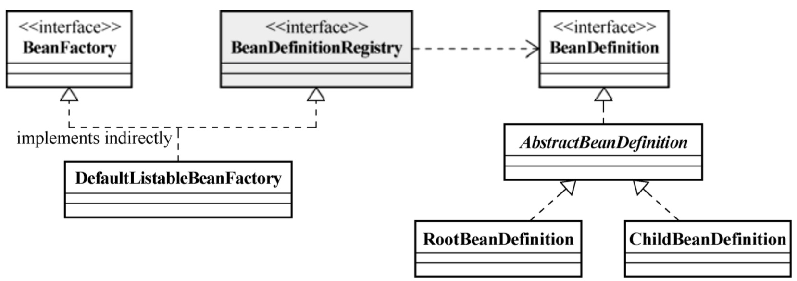
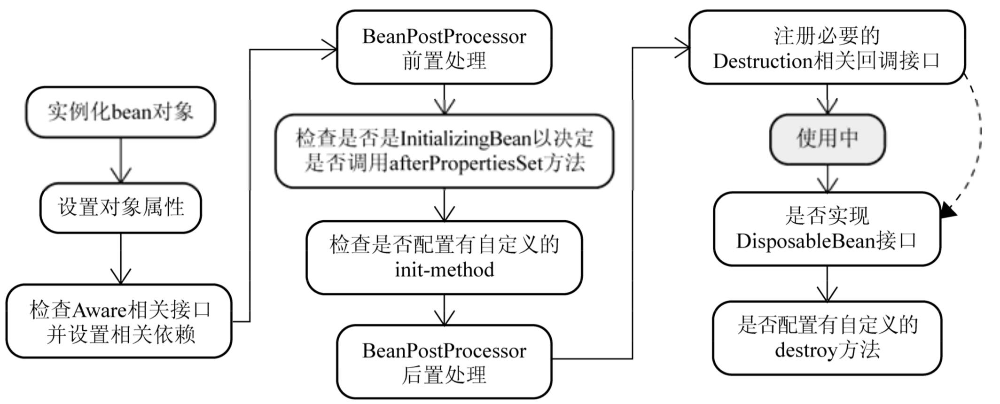
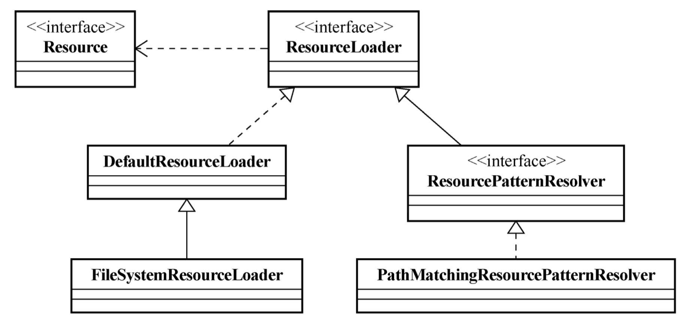
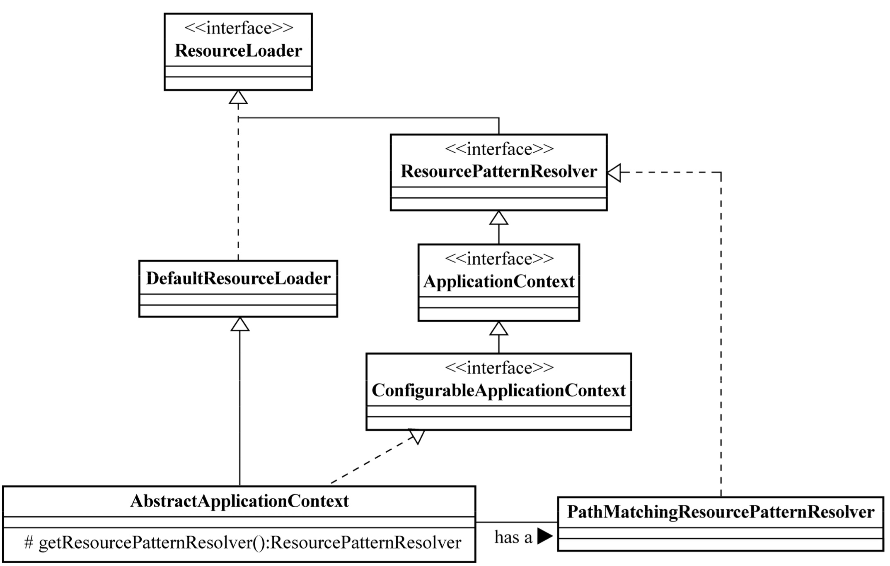
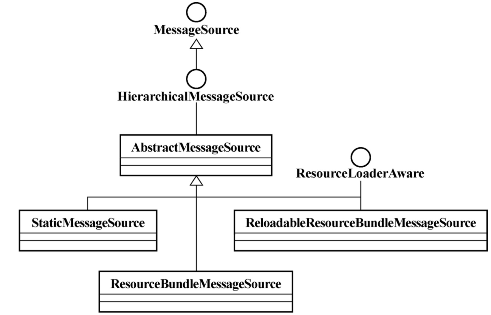
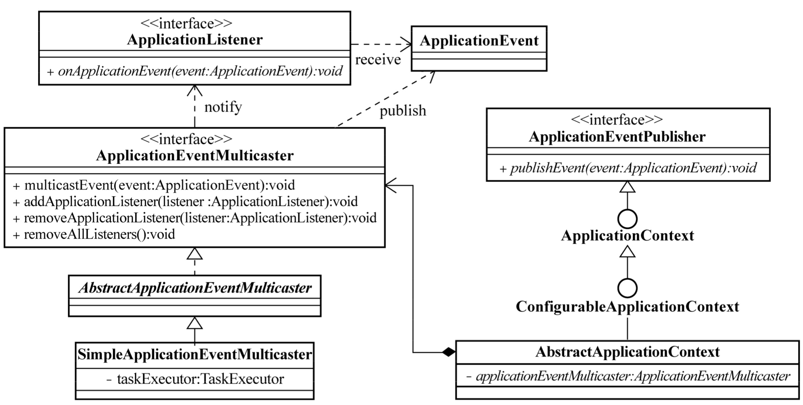

# SpringIOC

## Spring架构

## IOC理念

控制反转和依赖注入。

## Spring IOC

- Spring的IoC容器和IoC Service Provider之间的关系

  
  
- Spring有两种容器类型

  - BeanFactory
    
    - 提供完整的IOC功能，默认延迟加载初始化对象，容器启动速度比较快，节约资源，适合资源有限场景。
    
  - ApplicationContext
    
    - 拥有BeanFactory所有功能基础上，提供事件发布、国际化等功能。容器启动后，默认所有对象全部初始化完成，需要更多资源，启动较BeanFactory慢。
    
  - 关系
  
    

## BeanFactory

### DefaultListableBeanFactory

一个比较通用的BeanFactory实现类，负责bean的注册和管理。

- BeanFactory

  定义如何访问容器内管理的Bean的方法。

- BeanDefinitionRegistry

  管理bean的注册和加载。

- BeanDefinition

  负责保存对象的所有必要信息，包括其对应的对象的class类型、是否是抽象类、构造方法参数以及其他属性等。

- 关系图

  

### BeanDefinitionReader

- 根据不同的外部配置文件格式，不同的BeanDefinitionReader实现类，将相应的配置文件内容读取并映射到BeanDefinition，然后将映射后的BeanDefinition注册到一个BeanDefinitionRegistry，之后，BeanDefinitionRegistry完成Bean的注册和加载。
- Spring内置常用的实现类：PropertiesBeanDefinitionReader和XmlBeanDefinitionReader。分别处理properties文件和xml文件。

### Scope

- singleton
  - 在Spring的IoC容器中只存在一个实例，所有对该对象的引 用将共享这个实例。该实例从容器启动，并因为第一次被请求而初始化之后，将一直存活到容器退出。
  - 注意和单例模式的区别。
- prototype
  - 接到该类型对象的请求的时候，会每次都重新生成一个新的对象实例给请求方。虽然这种类型的对象的实例化以及属性设置等工作都是由容器负责 的，但是只要准备完毕，并且对象实例返回给请求方之后，容器就不再拥有当前返回对象的引用，请 求方需要自己负责当前返回对象的后继生命周期的管理工作，包括该对象的销毁。
  - prototype声明的一般都是**有状态**的对象。
  - 注意和原型模式的区别。
- 自定义scope类型
  - org.springframework.beans.factory.config.Scope接口

### FactoryBean

- 工厂方法模式
- 容器默认返回的是FactoryBean中工厂方法返回的实例，而不是FactoryBean实现类自身。可以通过在bean定义前面加&获取FactoryBean实现类自身实例。

### Spring IoC实现

- 分为容器启动阶段和Bean实例化阶段。

  - 容器启动阶段

    加载解析配置信息，并封装到BeanDefinition，执行一些后处理（BeanFactoryPostProcessor）。

  - Bean实例化阶段

    实例化对象，装配依赖，生命周期回调，对象其它处理，注册回调接口。

- BeanFactoryPostProcessor

  - 在容器实例化相应对象之前，对注册到容器的BeanDefinition所保存的信息做相应的修改。

  - 常用内置BeanFactoryPostProcessor

    - PropertyPlaceholderConfigurer

      会从系统属性（设置SystemPropertiesMode）或者properties文件中获取数据替换XML配置文件中的占位符。

    - PropertyOverrideConfigurer

      对容器中配置的任何property配置信息进行覆盖替换。可以重写convertPropertyValue()方法实现对配置信息加解密。

    - CustomEditorConfigurer 

      完成由字符串到具体对象类型的转换。

- Bean生命周期

  

  - BeanFactory容器启动之后，并不会马上实例化相应的bean定义。只有当请求方（显式或者隐式）通过BeanFactory的getBean()方法（AbstractBeanFactory.getBean()）来请求某个对象实例的时候，才有可能触发Bean实例化阶段的活动。
  - 只有第一次调用BeanFactory的getBean()方法才会触发Bean实例化。第二次会直接从缓存中返回。（prototype类型bean除外）
  - Spring容器将对其所管理的对象全部给予统一的生命周期管理。（prototype类型bean除外）
  - 采用策略模式决定采用何种方式初始化bean实例。InstantiationStrategy定义是实例化策略的抽象接口。容器内部默认采用CglibSubclassingInstantiationStrategy，通过CGLIB的动态字节码生成功能创建对象。
  - 使用BeanWrapper对构造完成的对象实例进行包裹，返回相应的BeanWrapper实例。BeanWrapper可以方便的对实例属性值进行操作设置。
  - 当对象实例化完成并且相关属性以及依赖设置完成之后，Spring容器会检查当前对象实例是否实现了一系列的以Aware命名结尾的接口定义，如果是，将Aware接口中规定的资源注入实例。
  - 使用BeanPostProcessor对容器内所有符合条件的实例进行处理。如ApplicationContextAwareProcessor用来为所有实现Aware接口的类注入相应的依赖。
  - InitializingBean和init-method
  - DisposableBean与destroy-method

## ApplicationContext

### Resource和ResourceLoader

- Resource是Spring中所有资源的抽象和访问接口。

- ResourceLoader是查找定位资源的抽象接口，根据资源路径返回单个Resource实例。默认实现为DefaultResourceLoader。支持classpath:协议。

- ResourcePatternResolver是ResourceLoader子类，根据资源路径匹配模式返回多个Resource实例。最常用实现为PathMatchingResourcePatternResolver。支持classpath*:协议。

- classpath:和classpath*:区别

  如果在classpath下找到多个指定资源，classpath*:会返回多个。

### ApplicationContext和ResourceLoader

- ApplicationContext可以作为一个ResourceLoader或者ResourcePatternResolver。

### MessageSource

### ApplicationContext和MessageSource

- 在默认情况下，ApplicationContext将委派容器中一个名称为messageSource的Message- Source接口实现来完成MessageSource应该完成的职责。如果找不到这样一个名字的MessageSource实现，ApplicationContext内部会默认实例化一个不含任何内容的StaticMessageSource实例，以保证相应的方法调用。

### 容器事件发布

- ApplicationEvent

  - Spring容器内自定义事件类型，继承自java.util.EventObject，它是一个抽象类，需要根据情

    况提供相应子类以区分不同情况。

- ApplicationListener

  - ApplicationContext容器内使用的自定义事件监听器接口，继承自java.util.EventListener。ApplicationContext容器在启动时，会自动识别并加载EventListener类型bean定义， 一旦容器内有事件发布，将通知这些注册到容器的EventListener。

- ApplicationContext

  - ApplicationContext继承了ApplicationEventPublisher接口，担当了事件发布者的角色。不过在具体实现上，ApplicationContext将具体的事件发布委托给plicationEventMulticaster接口，其抽象实现类AbstractApplicationEventMulticaster实现了对事件监听器的管理功能，SimpleApplicationEventMulticaster类实现了具体的事件发布功能。默认使用SyncTaskExecutor进行事件的发布，事件是同步顺序发布的。
  - 容器启动时会检查容器内是否存在名称为applicationEventMulticaster的ApplicationEventMulticaster对象实例。有的话就使用提供的实现，没有则默认初始化一个SimpleApplicationEventMulticaster作为将会使用的ApplicationEventMulticaster。