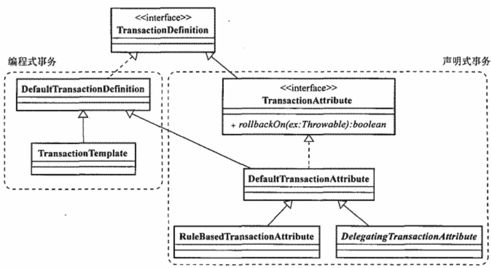
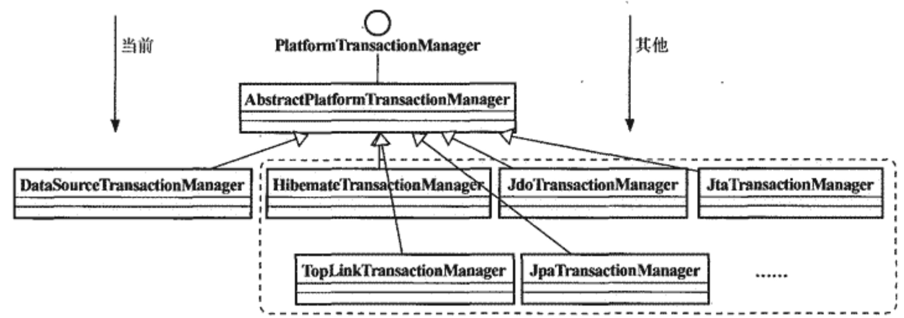

# Spring事务管理

## ACID

## 事务隔离级别

## 事务传播行为

## Java事务管理

### 局部事务

- JDBC的Connection
- JMS的Session
- JCA

### 全局事务

- JTA
- JCA

### 存在问题

- 局部事务管理跟具体数据访问方式耦合。
- 没有统一的异常处理体系。
- 开发人员只关心事务边界的指定，规定事务的开始和结束。

## Spring事务管理

### 设计理念

使事务关注点和数据访问关注点相分离。

### 实现原理

提供一个独立的事务管理器类，在事务开始时，将实现事务的事务资源（如JDBC的Connection）绑定到当前线程中，等到事务结束（提交或者回滚）时，再从当前线程中取出该同一个事务资源进行处理，保证了整个流程处于同一事务中。

### PlatformTransactionManager

- Spring事务管理体系的顶层抽象，采用了策略模式，根据不同的数据访问方式提供不同的实现类，分为面向局部事务和全局事务实现类。主要作用是提供界定事务边界的统一方式。

#### TransactionDefinition

- TransactionDefinition定义事务的相关属性，为PlatformTransactionManager创建事务提供信息。
  - 隔离级别
  - 传播行为
  - 超时时间
  - 是否是只读事务
- TransactionTemplate主要是面向编程式事务的场景。
- TransactionAttribute主要面向使用Spring AOP进行声明式事务的场景。其rollbackOn()方法定义业务方法抛出哪些异常时会回滚事务。子类DefaultTransactionAttribute实现了rollbackOn()，并定义了默认情况下，当异常为非检查性异常时，会回滚事务。

#### TransactionStatus

- TransactionStatus用来负责事务开启后到事务结束前期间的事务状态，也可以用来对事务有限的控制。主要使用子类DefaultTransactionStatus记录事务状态信息。

#### 实现原理

AbstractPlatformTransactionManager是所有PlatformTransactionManager实现类的父类，采用模板方法模式，定义统一的事务处理逻辑，只将跟事务资源相关操作留给子类实现。以DataSourceTransactionManager为例，

- getTransaction()开启事务
  - doGetTransaction()获取事务资源，如DataSourceTransactionManager的事务资源是DataSourceTransactionObject，是通过TransactionSynchronizationManager从当前线程中获取。
  - isExistingTransaction()判断当前是否存在事务，然后根据传入的不同事务传播行为选择挂起还是抛出异常。如果存在当前事务，统一由handleExistingTransaction()根据不同事务传播行为进行处理。如果不存在事务，也同样会根据不同事务传播行为进行处理。
- commit()提交事务
  - TransactionStatus.isCompleted()检查检查当前事务是否已结束。
  - 检查rollbackOnly标记，如果是true，则会通过processRollback()执行回滚操作。否则会通过processCommit()执行提交操作。
  - processCommit()主要逻辑和processRollback()差不多，就是多了一些扩展点。详见AbstractPlatformTransactionManager.processCommit()。
- rollback()回滚事务
  - TransactionStatus.isCompleted()检查当前事务是否已结束。
  - 通过processRollback()执行回滚操作。
  - processRollback()主要逻辑
    - 通过triggerBeforeCompletion()前置处理。
    - 如果有Savepoint，通过rollbackToHeldSavepoint()释放Savepoint。
    - 如果当前是一个新事务，通过Connection.rollback()回滚事务。
    - 如果当前已经存在事务，并且rollbackOnly被设置，则通过doSetRollbackOnly()将rollbackOnly标记为true。
    - 通过triggerAfterCompletion()后置处理。
    - 通过cleanupAfterCompletion()清理资源。

- suspend()
  - 暂停事务，将挂起事务的资源从TransactionSynchronizationManager中解除绑定，并将其存入SuspendedResourcesHolder中。
- resume()
  - 恢复事务，将挂起事务的资源从SuspendedResourcesHolder取出，并重新绑定到TransactionSynchronizationManager中。

### 编程式事务

- 可以使用PlatformTransactionManager或者TransactionTemplate。TransactionTemplate本质就是对PlatformTransactionManager操作流程的封装（TransactionCallback）。
- 默认TransactionTemplate只会处理TransactionCallback中抛出的非检查性异常，并执行回滚操作。所以在TransactionCallback中对于非检查性异常不需要处理，但是对于检查性异常需要自行捕捉处理。
- 要想在TransactionCallback处理过程中手动将事务回滚有两种方式，一种是抛出非检查性异常，另一种是设置当前事务rollbackOnly标记为true。

### 声明式事务

- 原因
  - 解决了编程式事务中，事务管理代码和业务逻辑代码相互混杂的问题。

- 实现方式
  - ProxyFactoryBean+TransactionInterceptor
    - TransactionInterceptor实现了MethodInterceptor，采用Spring AOP Around Advice方式为业务方法切入事务管理的逻辑。
    - TransactionInterceptor需要传入一个PlatformTransactionManager和一个TransactionAttribute，其中PlatformTransactionManager用于界定事务边界，TransactionAttribute用于定义事务所需要的信息，可以以Properties或者TransactionAttributeSource提供。
  - TransactionProxyFactoryBean
    - 集成了ProxyFactoryBean和TransactionInterceptor
  - BeanNameAutoProxyCreator自动代理
    - 利用Spring AOP的自动代理BeanNameAutoProxyCreator，根据提供的TransactionInterceptor里面的信息，自动为传入的beanNames创建其代理对象，并切入事务管理的逻辑，从而实现事务管理的功能。
  - @Transactional
    - 原理
      - 通过反射读取@Transactional的内容并生成AnnotationTransactionAttributeSource对象，根据这些信息提供事务支持。见SpringTransactionAnnotationParser.parseTransactionAnnotation()。
    - @Transactional可以加类级别上，所有方法都会继承其元数据信息。也可以加方法上。
    - 不要将@Transactional加到业务接口上，而是要加到具体实现类或者方法上，因为SpringAOP如果采用CGLIB方式代理，业务接口上注解的信息无法读取。